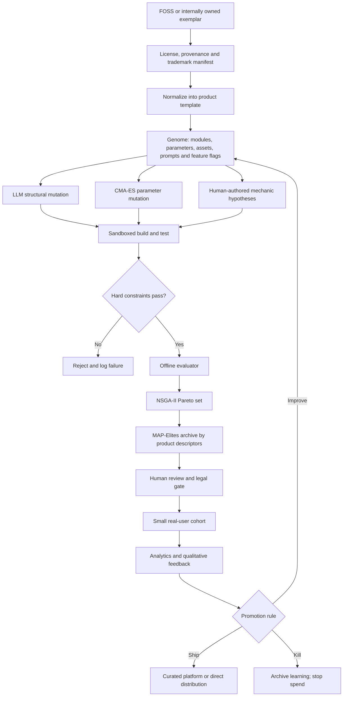
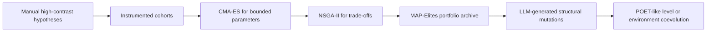

<!--
schema_id: hfo.gen133.deep_research_capsule.v0_1
source_family: OpenAI_ChatGPT_Deep_Research_GPT_5_6_Sol_Pro
prompt_source: olrun_prompt_2_evolution_exemplars (operator direct)
received_utc: 2026-08-03T~morning
persisted_by: operator_manual_paste_via_dispatch
doc_label: D6
approved_status: unapproved (awaits sigrun_curation V4)
-->

# Evolutionary DLC-Style Product Pipeline for FOSS Assimilation and Revenue

## Executive summary

The central finding is negative but useful: **formal evolutionary algorithms have almost no documented 2024–2026 track record of helping solo or small teams produce externally measurable software-product outcomes such as revenue, users, installs, or retention.** The strongest production evidence is Google DeepMind’s AlphaEvolve, which generated a Borg scheduling heuristic that has run in production for more than a year and recovers an average 0.7% of Google’s worldwide compute capacity; it also produced a kernel improvement that reduced Gemini training time by about 1%. That is compelling evidence that evaluator-driven code evolution can work, but it is a hyperscaler infrastructure case, not evidence that MAP-Elites, NSGA-II, POET, or CMA-ES will discover marketable game mechanics for a solo developer. citeturn19view0

DSPy provides a second, weaker production proof: Shopify reports roughly a 550-fold cost reduction for a structured-metadata extraction process optimized with DSPy and GEPA, while Dropbox and other companies report production use. These are internal cost or quality outcomes at large organizations, not small-team product revenue. Voyager remains a research demonstration; OpenEvolve has reproducible optimization examples but no independently verified commercial product outcomes. citeturn19view1turn19view2turn2search0turn2search19

The commercial case studies point to a different mechanism. Balatro, Halls of Torment, Quordle, MacWhisper, Photo AI, SEObot, and Lancer succeeded by combining a proven interaction model with **one legible new promise**, then attaching the combination to an effective distribution channel. They were not primarily “better optimized clones.” Balatro combined poker hand recognition with roguelike deck manipulation; Halls of Torment combined the Vampire Survivors loop with Diablo-style presentation and progression; Quordle made Wordle simultaneous and multi-board; MacWhisper wrapped Whisper in a private native workflow; Photo AI converted Stable Diffusion into a personalized virtual photo studio. citeturn3search4turn3search18turn4search11turn17search21turn18search0

The word **reskin** therefore understates the requirement. A viable pipeline needs four kinds of differentiation:

| Layer | Required differentiation |
|---|---|
| Mechanic | A visibly new rule, constraint, progression system, multiplayer mode, workflow, or content generator |
| Market | A narrower audience with an expensive or frequent problem |
| Distribution | A platform, search query, integration ecosystem, community, or outbound sales motion |
| Operations | Better loading, onboarding, privacy, automation, reliability, or unit economics |

FOSS reduces implementation time. It does not confer the original product’s demand, brand, traffic, or platform relationships. Open-source code rights also do not automatically grant rights to names, logos, distinctive art, character designs, or confusingly similar branding; those assets and marks require a separate audit. citeturn20search3turn20search11

For the immediate four-day decision:

* **Highest probability of obtaining an external product signal this week:** audit the twenty existing games, select the best two to four, instrument them, and submit those to itch.io, CrazyGames Basic Launch, and—where compatible—the reopened Kongregate. Do not indiscriminately upload all twenty.
* **Highest probability of earning the first $500:** a tightly scoped contract or productized service is materially more likely than any new game or micro-SaaS.
* **Worst immediate bet:** a four-day Suika clone/reskin aimed directly at Poki. Poki is hand-curated, currently limited-access, requires web exclusivity, evaluates the core loop and cross-device performance, and does not promise a response to every submission. citeturn19view3

My judgmental priors, not published platform statistics, are:

| Immediate option | Probability of meaningful external signal | Probability of first $500 |
|---|---:|---:|
| Triage and submit the best existing games | 65–85% within 14–21 days | 3–12% within 90 days |
| Four-day FOSS reskin submitted cold to Poki | 2–8% within 30 days | 1–5% within 90 days |
| Brand-new micro-SaaS | 15–35% within 30 days | 5–20% within 90 days |
| Productized contract, warm or relevant network | 35–65% response/sales signal within 14 days | 20–50% within 30 days |
| Productized contract, completely cold outreach | 15–35% response/sales signal within 14 days | 5–20% within 30 days |

The recommended longer-term system is not an unconstrained “AI swarm that mutates repositories.” It is a **constraint-first product-variation system**:

1. License, trademark, security, and test gates eliminate invalid candidates.
2. LLM agents propose bounded feature patches against standardized extension points.
3. CMA-ES tunes continuous parameters such as difficulty curves.
4. NSGA-II maintains trade-offs among engagement, performance, cost, complexity, and risk.
5. MAP-Elites stores diverse high-performing product variants only after the evaluator is trustworthy.
6. Real users, not LLM judges, determine promotion into distribution.

## Evidence standard and pipeline design

### What counts as a qualifying production case

For this report, a strong match requires all of the following:

| Requirement | Interpretation |
|---|---|
| Recent | Publicly documented in 2024–2026 |
| Production | Actually deployed to users or production infrastructure |
| Small operator | Solo developer or a clearly small team |
| Formal method | The named evolutionary or optimization framework materially drove changes |
| External outcome | Revenue, paying users, installs, retention, usage, or another market-facing result |
| Reproducibility | Enough architecture, repository, library, or evaluator information to reproduce the core process |

Internal compute savings count as real production evidence, but not as evidence of product-market discovery. Academic demonstrations, benchmark scores, simulated users, and researcher-built industrial scheduling examples do not meet the requested standard.

The public evidence is highly selected. Founders usually report revenue without disclosing optimization methods; researchers disclose optimization methods without commercial outcomes. Consequently, “none found” means **no qualifying public case identified in the reviewed primary and near-primary sources**, not proof that no private deployment exists.

### Recommended operating model

The economical version of an evolutionary product system separates the expensive real-world evaluator from cheap offline filtering.



The candidate representation should be declarative rather than an arbitrary branch:

```yaml
candidate:
  base_commit: "sha256-or-git-sha"
  provenance_manifest: "licenses.spdx.json"

  mechanics:
    primary_mode: "merge"
    modifiers:
      gravity_curve: 0.83
      combo_decay_seconds: 4.2
      hazard_frequency: 0.13
      daily_seed: true
      asynchronous_ghost: true

  presentation:
    theme_pack: "deep-sea-original-v3"
    onboarding_variant: "interactive-15s"
    audio_pack: "licensed-pack-07"

  monetization:
    ad_break_policy: "between-runs-only"
    cosmetic_store: false

  build:
    target: "html5"
    max_initial_bytes: 8000000
```

This makes mutations auditable and prevents an LLM from silently rewriting payments, tracking, license notices, authentication, or security-critical code.

### Fitness hierarchy

A single scalar “revenue fitness” is the wrong early evaluator. Revenue is sparse, delayed, geographically variable, and easily corrupted by traffic mix. A staged hierarchy is safer:

| Stage | Measures | Promotion condition |
|---|---|---|
| Legality | License coverage, notices, asset provenance, name similarity | No unresolved red flags |
| Correctness | Unit/E2E tests, deterministic seeds, save compatibility, payment tests | No critical failures |
| Performance | Initial bytes, startup time, frame stability, memory, crash rate | Platform-compatible |
| Comprehension | Start conversion, tutorial completion, first-success time | Players understand the loop |
| Engagement | Median session, run count, return rate, completion/failure distribution | Beats internal baseline |
| Economics | Ad opportunities without interruption, conversion, support and compute cost | Positive expected contribution |
| Portfolio value | Novelty, audience overlap, maintainability, channel fit | Adds information or revenue diversity |

MAP-Elites is valuable at the last stage: it can preserve the best candidate in distinct niches such as “short-session mobile puzzle,” “high-retention desktop strategy,” or “low-byte instant game.” The official `pyribs` package implements MAP-Elites-family quality-diversity methods and CMA-ME; `pymoo` provides maintained NSGA-II and NSGA-III implementations; `pycma` provides CMA-ES for difficult derivative-free continuous optimization. citeturn20search0turn20search4turn20search5turn20search9turn20search2turn20search10

## Formal evolutionary algorithms in production

### Evidence table

| Method | Qualifying 2024–2026 solo/small-team case | Closest production evidence | Outcome | Architecture and reproducible tooling | Verdict |
|---|---|---|---|---|---|
| MAP-Elites / quality diversity | **None found** | Recent public work remains dominated by research, simulation, robotics, design search, and kernel optimization rather than revenue-producing software products. `pyribs` is the official implementation of CMA-ME and related quality-diversity algorithms. | No public small-team revenue, users, installs, or retention outcome found | [`pyribs`](https://github.com/icaros-usc/pyribs); archive + emitters + scheduler; candidate descriptors and objective | Promising for portfolio diversity, but commercially unvalidated for this use case. citeturn20search0turn20search4turn0search4 |
| Novelty Search | **None found** | Public deployments located were research demonstrations rather than commercial software-product systems. | None meeting criterion | Novelty descriptor archive; distance metric; constrained mutation | Useful as an anti-convergence component, not presently supported as a standalone product strategy |
| POET / open-ended environment-agent coevolution | **None found** | The POET literature demonstrates coevolving environments and agents, but no recent solo/small-team product deployment with revenue or user metrics was located. | None meeting criterion | Environment generator, minimal criterion, agent transfer and optimization | Too evaluator-intensive and difficult to govern for a four-day or $500 operation |
| NSGA-II / NSGA-III | **None found** | A 2024 valve-manufacturing scheduling study is an industrial problem formulation, but it is an academic evaluation rather than an independently documented product deployment. | Optimization result, not a public market outcome | [`pymoo`](https://github.com/anyoptimization/pymoo); non-dominated ranking, crowding distance or NSGA-III reference directions | Strong engineering tool once objectives are measurable; no evidence that it creates demand. citeturn0search1turn20search1turn20search5turn20search9 |
| CMA-ES | **None found** | Mature production-capable implementations exist, including `pycma` and CyberAgent’s `cmaes`, but no qualifying public small-product outcome was found. | None meeting criterion | [`pycma`](https://github.com/CMA-ES/pycma); [`cmaes`](https://github.com/CyberAgentAILab/cmaes); ask/tell loop over continuous or mixed parameters | Best immediate use is tuning bounded numerical mechanics, not mutating whole products. citeturn20search2turn20search6turn20search10turn20search26turn20search30 |
| AlphaEvolve | No small-team case; **one major production case** | Google DeepMind evolved a Borg scheduling heuristic deployed for more than one year. It also improved a Gemini kernel and contributed a verified hardware rewrite. | Average recovery of 0.7% of Google’s worldwide compute; 23% kernel speedup producing about 1% lower Gemini training time | LLM proposal generation, evolutionary database, automated evaluators, verified code and human deployment gates | Strong proof of evaluator-driven code evolution; poor direct analogy to consumer product evolution because Google has deterministic, high-volume evaluators. citeturn19view0 |
| OpenEvolve | **None independently verified** | Open-source AlphaEvolve-style implementation reports 2–3× hardware speedups and algorithmic examples. The claims are primarily repository-maintainer results. | Benchmark and hardware optimization claims; no verified revenue/users | [`OpenEvolve`](https://github.com/algorithmicsuperintelligence/openevolve), Apache-2.0; evaluator scripts, island populations, Pareto optimization and reproducible examples | Useful experimental substrate; commercial evidence absent. citeturn19view1turn0search11 |
| Voyager-style skill growth | **None found** | Voyager demonstrated automatic curriculum, iterative prompting, environmental feedback, and a reusable Minecraft skill library. | Benchmark exploration and skill-acquisition results, not production users or revenue | Skill library, execution feedback, curriculum generator, iterative code repair | Architecturally relevant to agent skills, but its evidence is a research environment. citeturn2search0turn2search19 |
| DSPy / GEPA prompt-program optimization | No qualifying small-team commercial case; **large-company production evidence** | DSPy reports production use at Shopify, Dropbox, Microsoft AI, AWS, and others. Shopify reports roughly 550× lower yearly cost for structured metadata extraction. | Large internal cost reduction; external revenue and team size not disclosed | [`DSPy`](https://github.com/stanfordnlp/dspy); signatures, modules, metrics, training examples and optimizers | Best-supported near-term optimizer for LLM workflows, but it optimizes prompt/program behavior, not arbitrary product code. citeturn19view2turn2search31 |

### Practical assignment of each algorithm

**MAP-Elites should manage diversity, not decide what to build.** A useful archive for HTML5 games might use descriptors such as median session duration, control complexity, initial download size, randomness, and mobile-versus-desktop skew. The archive objective could be a conservative engagement score. The danger is descriptor theater: if descriptors are not tied to business-relevant niches, the system merely produces a colorful grid.

**Novelty search should be a secondary pressure.** A novelty term can stop the swarm from generating twenty nearly identical themes, but pure novelty rewards difference without usefulness. Give novelty perhaps 5–20% influence and impose hard product and quality constraints.

**POET is a later research project.** Coevolving game levels and agents is plausible for automated difficulty generation, tutorials, enemy patterns, and robustness testing. It is not a sensible initial commercial architecture because the simulated agent’s competence is unlikely to predict human enjoyment.

**NSGA-II is the product selection layer.** Suitable objectives include:

\[
\text{maximize }(D1\ return,\ median\ session,\ contribution\ margin,\ novelty)
\]

\[
\text{minimize }(load\ time,\ crash\ rate,\ maintenance\ complexity,\ IP\ risk)
\]

NSGA-III becomes more useful when there are many genuinely independent objectives; with three or four noisy objectives, NSGA-II is easier to interpret.

**CMA-ES is the mechanic-tuning layer.** Candidate dimensions include spawn rates, enemy speed, collision tolerances, card probabilities, reward curves, ad cooldowns, and onboarding timing. It is poorly suited to free-form source mutation but well suited to a 10–50-dimensional parameter vector with noisy outcomes.

**LLM code evolution should be bounded by interfaces.** The agent may create a new modifier, enemy, card, report template, connector, or workflow node. It should not autonomously change authentication, licensing, telemetry consent, billing, deployment credentials, or asset provenance.

### Likely near-term adopters

Based on evaluator availability rather than public adoption announcements, the most plausible adopters are:

| Domain | Why the evaluator is tractable |
|---|---|
| Database queries, kernels and compilers | Correctness can be tested and latency measured automatically |
| Ad and landing-page generation | High-volume conversion data exists, although platform policies constrain automated variation |
| Game balance | Parameters and simulated play can be evaluated cheaply, followed by human cohorts |
| Support and extraction agents | Labeled examples, cost, latency, and task success are measurable |
| Build systems and cloud scheduling | Objective runtime and resource metrics closely resemble AlphaEvolve’s successful setting |
| Search, ranking and recommendations | Offline judgments plus online interleaving or controlled experiments are available |

The least tractable areas are brand identity, humor, cultural resonance, narrative appeal, and whether a mechanic is “fun.” An LLM judge can filter obvious failures, but using it as the final fitness function risks optimizing for the model’s aesthetic rather than customers.

## Exemplar assimilation and commercial patterns

### Comparative case studies

Revenue figures below distinguish official or founder-reported figures from third-party estimates. Gross sales are not developer net income; platform fees, refunds, taxes, publisher shares, contractors, advertising, and compute can materially reduce proceeds.

| Product | Base exemplar or proven workflow | Meaningful addition | Publicly visible tooling | External outcome | Time to first meaningful revenue | Confidence |
|---|---|---|---|---|---|---|
| **Balatro** | Poker hand recognition; roguelike deckbuilding and score-combo games | Jokers with combinatorial effects, deck manipulation, escalating antes, consumables and strong run-to-run build discovery | Solo developer LocalThunk; publicly associated with Lua/LÖVE. Detailed CI, analytics, and AI use were not disclosed | Profitable within about an hour; 250,000 copies in 72 hours and 500,000 in ten days were publicly reported. Later total-sales reports exceed five million, but exact net developer revenue is private | Under one day after launch; approximately 2.5 years of development before launch | High for unit milestones; low for the user-supplied “$15M+” net claim. citeturn3search4turn3search16turn3search8 |
| **Halls of Torment** | Vampire Survivors’ auto-attack survival loop | Diablo-like pre-rendered aesthetic, hero quests, equipment, manual aiming options and more conventional ARPG progression | Godot; developed by Chasing Carrots, a small established team | More than one million Steam sales reported by October 2024; roughly 70,000 in the first week of Early Access was reported | Within the first paid-launch week | High on copies; net revenue undisclosed. citeturn3search6turn3search18turn3search10 |
| **Brotato** | Vampire Survivors / arena-survival loop | Six-weapon loadouts, dense stat economy, short waves, shop phase and potato-character readability | Toolchain details are incompletely disclosed in the sources reviewed | Third-party unit estimates range from roughly 3.5 million to 7.5 million, too wide to treat as audited | Unspecified; paid Early Access produced immediate sales | Medium-low; revenue and unit counts are estimates, not official audited data. citeturn3search9turn3search25 |
| **Boneraiser Minions** | Arena survival and auto-combat | Player builds an undead minion army rather than acting as the primary weapon; compact retro presentation | Public details incomplete | A third-party estimate placed gross Steam revenue around $566,000, not above $1 million | Unspecified | Low-medium. The claim that all named Vampire Survivors derivatives earned $1M+ is unsupported. citeturn3search11 |
| **Quordle** | Wordle | Four words solved simultaneously using each guess across all boards; nine guesses | Web app; detailed build and analytics stack not publicly disclosed | Reached approximately one million players within two months and was acquired by Merriam-Webster; acquisition price was not disclosed | Ads were introduced to cover costs; exact first-revenue date unspecified | High for audience, unknown for revenue. citeturn4search11turn4search19 |
| **Absurdle** | Wordle | Adversarial answer selection that delays commitment to a hidden word | Browser implementation; no commercial toolchain disclosed | Became a recognized variant, but no reliable revenue outcome was found | Unspecified | Commercial claim unverifiable |
| **Suika-like browser games** | Aladdin X’s proprietary Suika Game and earlier merge/drop puzzles | Theme changes, physics variations, hazards, daily challenges, score attacks and multiplayer variants | Commonly JavaScript plus Matter.js; the `moonfloof/suika-game` implementation is public-domain/Unlicense-style for its code and assets, with Matter.js under MIT | The original commercial game was successful, but no reliable revenue figure was found for the specific open clone | Unspecified | The clone’s permissive license does not prove that a look-alike commercial product will avoid trade-dress, naming, asset or platform-quality concerns. citeturn16view1 |
| **SEObot** | SEO agency and programmatic-content workflow | Automates keyword research, article generation, internal linking, publishing and parts of backlink workflow | Exact proprietary stack incomplete; product integrates into common web publishing workflows | Stripe-verified third-party dashboard reported about $47,500 MRR, roughly $1.8 million all-time revenue and more than 600 subscriptions as of August 2026 | Founded September 2023; first-revenue timing not disclosed | Medium: payment data is third-party presented as Stripe-verified, not audited company reporting. citeturn5search0turn5search2turn5search14 |
| **Lancer** | Manual Upwork search, qualification and proposal workflow | Automated job discovery, filtering, notifications and assisted proposals | Next.js, TypeScript, Node, Elasticsearch and Stripe were reported by its revenue-profile source | Approximately $19,000 MRR and $157,000 all-time revenue reported by August 2026; founder reports place the $10,000 MRR milestone within roughly two to four months | Public accounts conflict between about two and four months to $10,000 MRR | Medium; Stripe dashboard is stronger than narrative timelines, which conflict. citeturn5search3turn5search6turn4search10 |
| **Adspirer** | Cross-platform digital-ad campaign operations | Consolidates campaign creation, management and automation across ad channels | Proprietary; public toolchain details incomplete | A third-party revenue page reports nearly $500,000 gross volume in under three years and around 2,000 users, but its current-period fields are internally inconsistent | Unspecified | Low-medium; do not rely on the headline monthly number without direct Stripe verification. citeturn4search14 |
| **MacWhisper** | OpenAI Whisper’s MIT-licensed speech-recognition code and weights | Native Mac UI, local/offline processing, meeting detection, watched folders, exports, prompts, CLI and automation integrations | Whisper and other local models; native Mac application; webhooks and integrations to Notion, Zapier, Obsidian, n8n and Make | A secondary founder-profile source reported $100,000 cumulative revenue; current product revenue is not publicly audited | Launched January 2023; exact first-sale timing unspecified | Medium-low for revenue, high for product differentiation. citeturn18search1turn18search2turn18search5turn17search0turn17search21 |
| **Photo AI** | Stable Diffusion-style image generation and personalized model training | Turns model capability into a self-service photo studio with personal model training, themed shoots, virtual try-on and commercial workflows | Founder reports originally described raw PHP, JavaScript/jQuery and hosted GPU/model providers; FAL later served the production models | Founder reported $61,808 monthly revenue and 1,872 paying customers by July 2023; $161,000 monthly in September 2024; and $105,000 monthly revenue with $80,000 monthly profit in March 2026 | Founder says near-profitability occurred within days of the February 2023 launch | High for founder-reported figures, although not independently audited. citeturn18search0turn18search3turn18search6turn18search12turn18search15 |

### What the winners actually assimilated

The reusable unit is rarely the complete product. It is usually one of five structures:

| Pattern | Assimilated asset | Differentiation mechanism | Examples |
|---|---|---|---|
| **Genre cross** | Proven core loop | Import a progression, economy or fantasy from another genre | Balatro; Halls of Torment |
| **Constraint multiplication** | Simple daily puzzle | Apply one input across several coupled problems | Quordle |
| **Native workflow wrapper** | General-purpose model | Privacy, offline operation, OS integration and workflow automation | MacWhisper |
| **Verticalized capability** | Foundation model or OSS engine | Narrow audience, templates, integrations and outcome-oriented UX | Photo AI; vertical transcription products |
| **Agency-to-software compression** | Repetitive service workflow | Automate research, execution, reporting and recurring operations | SEObot; Lancer; Adspirer |

A raw theme swap does not create a robust competitive advantage. The most defensible small-team transformations usually add one or more of:

* Persistent progression or user-owned data.
* A multiplayer, social, daily or competitive loop.
* A specific professional workflow.
* Proprietary templates, datasets or integrations.
* Better privacy, latency, deployment or reliability.
* Search-discoverable content or embedded distribution.
* A recurring operational job that users do not want to repeat manually.

### Tooling disclosure is weaker than revenue disclosure

There is little evidence that the successful cases used MAP-Elites, NSGA-II, automated code mutation, or even formal experimentation. Publicly visible approaches are generally conventional:

| Function | Common practical implementation |
|---|---|
| Fast assimilation | Fork or reimplementation, established engine/framework, existing model weights |
| Differentiation | Founder-authored mechanic or workflow hypothesis |
| Asset production | Original commissioned assets, procedural assets, licensed packs, or AI-assisted generation with manual selection |
| Iteration | Direct player/customer feedback, analytics, platform feedback and founder judgment |
| Distribution | Steam, browser portals, SEO, founder audience, integrations, acquisition or outbound sales |
| Monetization | Paid download, subscription, usage tiers, ads, credits or service upsell |

That absence matters. It suggests that formal evolution should be treated as an **operations multiplier after a viable hypothesis exists**, not as the source of the initial market insight.

## Curated platform access and economics

### Interpretation of estimates

None of the reviewed platforms publishes a statistically usable cold-submission acceptance rate or probability of reaching $500. The estimates below are deliberately conservative, based on the documented gates, available traffic tests, monetization rules, public anecdotes, and the difference between being technically listed and being meaningfully distributed.

“Accepted” means:

* Poki: selected for partnership and publication.
* CrazyGames: reaches **Full Launch**, not merely the non-monetized Basic Launch.
* Kongregate and Game Jolt: approved and published.
* Product Hunt: visible in the default featured feed where specified.
* AI registries: publicly discoverable and policy-compliant.

### Platform comparison

| Platform | Current acceptance and review | Published economics | Estimated cold acceptance | Estimated P(first $500 \| accepted) | Typical timing | Confidence |
|---|---|---|---:|---:|---|---|
| **Poki** | Closed-beta/limited-access developer program. Every game is manually checked for core-loop quality, UX/feel, audience fit, technical quality, and mobile/desktop optimization. Cross-device titles are favored. Poki says it cannot answer every submission. Accepted games receive homepage spotlight and require open-web exclusivity. | Developer receives 100% of revenue from direct/bookmark/search/social/community traffic; Poki-sourced and Poki-marketed users are split 50/50. | **1–5%** for a cold solo submission with no track record; no official rate | **35–65%** within 90 days, conditional on actually launching and receiving the promised spotlight | Response unspecified; integration and iteration likely weeks. Greater prominence can take months. | Low for probabilities, high for published rules. citeturn19view3turn8search4turn8search9turn8search15 |
| **CrazyGames** | Manual QA. A game generally enters a two-week Basic Launch with a limited audience and monetization disabled. Average playtime, gameplay conversion and retention are benchmarked against other games. Strong titles proceed to Full Launch; weak titles require significant improvements before resubmission. | Ads and selected IAP become available only at Full Launch. General public docs reviewed do **not** state a universal 60% ad / 70% IAP split. Those percentages appear in limited secondary or event materials and should not be assumed contract-wide. | Basic technical launch **40–70%** after compliance; Full Launch **10–25%** of serious cold submissions | **15–35%** within 90 days | Two-week test, then integration/QA; commonly three to eight weeks to first monetized traffic | Low-medium. citeturn19view4turn7search1turn7search5turn7search12turn7search15turn7search18 |
| **Kongregate** | Reopened to new games in April 2026. Developer registration and approval plus game-content approval are required. | Eligible games approved after April 6, 2026 automatically receive **70% of net revenue** from ads and eligible virtual goods under the time-limited Welcome Back program. Program is targeted to end later in 2026. Payment threshold is reported as $500, with balances carrying forward. | **30–60%** for technically sound compliant browser games | **5–15%** within 90 days | Days to weeks for publication; revenue may take months to reach payment threshold | Medium on current terms; low on traffic probability. citeturn19view5turn6search3turn6search4turn6search5turn6search6 |
| **Miniclip** | Not an open cold-submit HTML5 portal comparable to CrazyGames. Miniclip reported ending partnerships with most third-party web-game developers as its business shifted; its current publishing material is oriented toward selected mobile relationships. | Negotiated publishing relationship; no broadly available browser payout formula identified | **Below 1%** without direct business-development invitation | Not meaningfully estimable | Months or no response | Medium. citeturn12search0turn12search5 |
| **Game Jolt** | Broad self-service community publication, subject to content and platform rules; less editorially scarce than Poki | For direct game marketplace sales, developers can choose a Game Jolt revenue cut below 10%. Separate user-generated-item economics may use different splits. | **70–95%** for a compliant game | **1–5%** within 90 days | Immediate to days for listing; sales highly dependent on bringing an audience | Medium. A developer self-report showed 68,000 lifetime page views but only 22 sales and $227, illustrating weak default conversion. citeturn12search1turn12search15turn12search18 |
| **Official MCP Registry** | Registry publication is primarily technical and namespace/schema governed rather than an editorial game-style selection. Sub-registries may add curation. | No native payment or revenue share identified. Registry provides discovery; paid API, hosted service, support or enterprise features must be monetized elsewhere. | **60–90%** if technically compliant and appropriately namespaced | **0% natively**; **3–10% indirectly** within 90 days for a strongly vertical paid service | Days for technical publication; weeks or months for off-platform customers | Medium. MCP was donated to the Agentic AI Foundation and had very large SDK download volume by late 2025, but ecosystem size does not equal buyer intent. citeturn19view6turn9search4turn9search5turn9search8turn9search13 |
| **OpenAI GPT Store** | Public GPT publication remains policy- and account-dependent. OpenAI originally announced a builder revenue program for the first quarter of 2024. | I found no current official 2026 documentation establishing a broad self-serve per-use payout available to typical solo GPT builders. OpenAI’s newer strategic surface is the MCP-based Apps SDK, whose general builder monetization was also not established in the reviewed official material. | **50–80%** for compliant public listing | **0–2% through native payout**; **1–5% indirect** | Listing can be fast; discovery and indirect conversion are unpredictable | Medium on official-document absence, low on individual discovery probability. citeturn9search2turn9search18turn9search27 |
| **Poe** | Bot creation and publication are broadly accessible, subject to policy and supported-country/payment requirements | Active creator monetization pays for engaging users. Creators may set a price per user message; developer APIs support implementation-specific monetization. | **60–90%** for compliant bots | **2–10%** within 90 days | Days to publish; weeks or months to accumulate paid usage | Medium. citeturn19view7turn10search0 |
| **Character.AI** | Character creation and discovery are accessible, with evolving creator and lorebook tools | No official native creator-revenue program was located in the reviewed 2026 creator materials | **80–95%** for a policy-compliant bot | **0–1% natively** | Immediate listing; no reliable native-revenue timeframe | Medium. citeturn11search0turn11search25 |
| **Product Hunt** | Self-submission is free. Products must be new or materially updated and usable. The default featured feed is algorithmically/editorially filtered. New accounts face a waiting period; Product Hunt advises establishing community presence before launch. | No marketplace payout. Value is traffic, backlinks, leads, feedback and possible sales. | Listing **80–95%**; default feature **10–25%** | **5–15%** for a featured paid micro-SaaS within 30 days; much lower for games without a Product Hunt-native audience | Launch-day traffic; most commercial signal appears within a week | Low-medium. Product Hunt reports that weekends can generate more visit clicks per launch while weekdays have stronger-company competition. citeturn10search3turn10search5turn10search6turn10search8 |

### CrazyGames revenue at one hundred thousand plays

No current official universal “dollars per 100,000 plays” figure was found. Public self-reports vary materially:

* One report associated roughly 50,000 plays with around $250.
* Older reports showed substantially lower revenue for similar play counts.
* Geography, session length, ad opportunity count, ad-blocking, fill rate, platform deductions, and whether “plays” means starts or monetized sessions can change the result dramatically. citeturn7search8turn7search13turn7search17

A defensible planning range is therefore **$100–$700 for 100,000 gameplay starts**, with a very wide tail and low confidence. Do not model $500 per 100,000 plays as guaranteed. More importantly, CrazyGames disables monetization during the initial two-week Basic Launch, so a weak candidate can generate useful engagement data and zero revenue. citeturn19view4

### Poki’s current editorial signal

Poki’s own case material demonstrates what it rewards. A small developer’s title reportedly went through 78 playtest builds before launch, generated five million gameplays in its first month, and achieved an average session around 6 minutes 28 seconds. Adding a player-controlled 3D world reportedly moved median engagement from roughly two minutes to four or five minutes; later multiplayer and competition features pushed average session duration to about 12–12.5 minutes and improved homepage prominence over approximately three months. citeturn8search4

That is not evidence that those exact session thresholds guarantee acceptance. It is evidence that Poki works iteratively with selected titles and values:

* A legible, replayable core loop.
* Significant engagement improvement from mechanics rather than decoration.
* Competitive or social features.
* Small files, progressive loading and broad-device performance.
* A partner willing to iterate repeatedly rather than upload a finished clone. citeturn19view3turn8search15

## Prioritized FOSS product inventory

### License and selection caveat

The ranking below is based on solo time-to-market, technical fit with Python/TypeScript, monetizable differentiation, and the ability to isolate a bounded feature genome. Ease-of-reskin is an engineering estimate, where five is easiest.

Before commercial release, pin the exact commit and store:

* Repository URL and commit.
* SPDX license data for the root and dependencies.
* Asset-by-asset provenance.
* Required notices and source-offer obligations.
* Trademark and naming review.
* Model and training-data usage terms.
* A list of replaced logos, names, characters, music, screenshots and store copy.

### Shortlist

| Priority | Candidate and repository | License and stack | Ease | Plausible monetization | Solo time to credible MVP | Recommended evolution |
|---:|---|---|---:|---|---|---|
| **1** | [`moonfloof/suika-game`](https://github.com/moonfloof/suika-game) | Public-domain dedication/Unlicense-style for listed code and assets; Matter.js MIT. JavaScript, HTML, Matter.js. | 5 | Portal ads, sponsorship, branded edition, cosmetics, premium mobile/desktop build | 3–7 days for a materially differentiated version | Replace all presentation; add daily seeded challenges, hazards, combo economy, asynchronous ghosts, a novel merge graph and one-handed mobile UX. Avoid a visually confusing Suika imitation. citeturn16view1 |
| **2** | [`openai/whisper`](https://github.com/openai/whisper) plus [`faster-whisper`](https://github.com/SYSTRAN/faster-whisper) | MIT. Python; CTranslate2 for faster-whisper. | 4 | Vertical transcription subscription, local desktop license, per-hour processing, compliance-oriented deployment, workflow integration | 1–3 weeks | Pick one domain—legal intake, field-service notes, research interviews, multilingual subtitles—and evolve diarization, vocabulary, structured extraction, exports and privacy modes. citeturn18search2turn18search5turn18search23 |
| **3** | [`louislam/uptime-kuma`](https://github.com/louislam/uptime-kuma) | MIT. Node.js/Vue, Docker. | 3 | Managed monitoring for agencies, game servers, local businesses or regulated niches; setup fees and support | 2–4 weeks | Add vertical onboarding, automatic discovery, client reporting, SLA evidence, billing, domain-specific checks and an AI incident summary. citeturn14search1turn14search7 |
| **4** | [`gabrielecirulli/2048`](https://github.com/gabrielecirulli/2048) | MIT. HTML, CSS and JavaScript. | 5 | Portal ads, sponsored themes, daily competition, premium puzzle pack | 2–5 days | Change the state transition, board topology or objective—not only tiles. Add constrained daily modes, combo drafting, ghost races or user-generated rule sets. citeturn13search5turn13search13 |
| **5** | [`excalidraw/excalidraw`](https://github.com/excalidraw/excalidraw) | MIT. TypeScript/React. | 3 | Vertical diagram SaaS, premium templates, collaboration, AI-to-diagram, exports and team workspace | 2–6 weeks | Do not sell a generic whiteboard. Build a specialized incident-map, system-design, classroom-math, sales-discovery or architecture-review product. citeturn15search2turn15search10turn15search25 |
| **6** | [`openstatusHQ/openstatus`](https://github.com/openstatusHQ/openstatus) | AGPL-3.0. TypeScript web application. | 3 | Managed status pages, private locations, incident automation, premium reports and support | 3–6 weeks | Verticalize around API vendors, agencies, multiplayer servers, AI agents or healthcare integrations; evolve alert policy and incident-copy generation. citeturn15search1turn15search9turn15search21 |
| **7** | [`formbricks/formbricks`](https://github.com/formbricks/formbricks) | Core AGPL-3.0; repository also contains separately licensed enterprise modules. TypeScript web stack. | 2 | Vertical survey/feedback SaaS, implementation services, templates and analytics | 4–8 weeks | Use only clearly licensed core components. Specialize for churn interviews, game playtests, agency client feedback, education or AI-agent evaluation. citeturn14search2turn14search5 |
| **8** | [`documenso/documenso`](https://github.com/documenso/documenso) | AGPL-3.0. TypeScript, React Router, Hono, Prisma, PostgreSQL and Stripe. | 2 | Vertical e-signature workflows, hosting, setup, templates, API integration and support | 6–12 weeks | Add a narrow document workflow such as contractor onboarding, photography releases or agency approvals. Security, identity, auditability and jurisdictional requirements make this higher-risk. citeturn16view2turn14search12 |
| **9** | [`Hextris/hextris`](https://github.com/Hextris/hextris) | GPL-3.0. JavaScript/HTML5. | 4 | Portal ads, sponsored editions, competitive modes and premium packaging | 4–10 days | Add rotating objectives, daily seeds, multiplayer attack mechanics, progression modifiers and a distinct visual identity. citeturn13search2 |
| **10** | [`modelcontextprotocol/typescript-sdk`](https://github.com/modelcontextprotocol/typescript-sdk) or [`python-sdk`](https://github.com/modelcontextprotocol/python-sdk) | New TypeScript contributions Apache-2.0 with existing code under MIT transition; Python SDK MIT. | 4 | Hosted connector, authenticated premium API, metered tool calls, enterprise deployment and support | 3–14 days | Build one high-value vertical server rather than a generic wrapper: license auditor, deployment evidence collector, game-portal submission checker, customer-support evidence pack or domain-specific workflow. citeturn15search3turn15search7turn15search31turn19view6 |

### Secondary candidates

| Candidate | Why it is not top tier |
|---|---|
| BrowserQuest | Valuable multiplayer foundation, but deprecated architecture, server operation, content requirements, MPL code and separate art licensing make four-day commercialization unrealistic. citeturn13search3 |
| Twenty CRM | Strong TypeScript platform and app model, but it is large, competitive and operationally heavy. A small vertical extension may be better than a fork. The current repository exposes app scaffolding, versioned customization and AI-agent primitives. citeturn16view0 |
| Windmill | Powerful AGPL workflow/dev platform, but too broad for a low-budget reskin. A paid vertical workflow pack or implementation service is more realistic than an independent fork. citeturn14search23 |
| OhMyForm | Easier survey base than some larger systems, but differentiation and distribution remain difficult in the saturated form market. citeturn14search8 |
| Generic GPT wrappers | Fast to build but weakly differentiated, platform-dependent and unsupported by a reliable native GPT Store payout system as of the reviewed 2026 documentation. citeturn9search18turn9search27 |

### Ranking by objective

The overall ranking changes with the target:

| Objective | Best candidates |
|---|---|
| Fastest portal signal | Suika-derived mechanic, 2048 structural variant, Hextris |
| Highest probability of recurring revenue | Vertical Whisper, managed Uptime Kuma/OpenStatus, vertical MCP server |
| Lowest license complexity | Suika repository at audited commit, 2048, Uptime Kuma, Excalidraw, Whisper/faster-whisper |
| Strongest fit for MAP-Elites | Parameterized puzzle/arena games; template-rich content tools |
| Strongest fit for NSGA-II | Monitoring, transcription, agent tools where cost/latency/accuracy are measurable |
| Strongest fit for CMA-ES | Game difficulty and economy; audio thresholds; ranking and alert policies |
| Highest operational/legal burden | E-signature, CRM, health/legal transcription, multiplayer services |
| Worst pure-reskin risk | Famous puzzle/game clones with copied names, art, store presentation or near-identical mechanics |

## Immediate decision and execution roadmap

### Tiebreak recommendation

The recommended move is a modified version of option A:

> **Do not bulk-publish twenty unresearched games. Run a one-day tournament, select the best three, instrument and repair those, then submit them to itch.io, CrazyGames Basic Launch, and Kongregate where technically compatible.**

This maximizes the probability of obtaining genuine user data without spending the full week on a new unvalidated clone. CrazyGames’ process is particularly useful because its two-week Basic Launch explicitly measures average playtime, gameplay conversion and retention against platform benchmarks, although monetization is disabled during that period. citeturn19view4

The recommendation changes if “external signal” means cash rather than product behavior. A fixed-price contract—such as converting an existing internal workflow into an MCP server, automating a reporting job, or shipping an AI-assisted content workflow—has a substantially higher probability of producing $500 than an unproven portal game.

### Comparative decision matrix

Scores are judgments from one to five, with five favorable except where stated.

| Factor | Existing games, selected submission | FOSS exemplar to Poki | New micro-SaaS | Productized contract |
|---|---:|---:|---:|---:|
| Can ship in four days | 5 | 3 | 3 | 4 |
| Existing sunk work reused | 5 | 1 | 1 | 2 |
| External users without own audience | 4 | 1 before acceptance; 5 after | 1–2 | 2–4 |
| Speed of evaluative feedback | 4 | 1 | 2 | 4 |
| Chance of $500 in 30 days | 1 | 1 | 1–2 | 4 |
| Long-term product equity | 2–3 | 3 if genuinely differentiated | 4 | 2 |
| Platform gate risk | 3 | 5 | 1–2 | 1 |
| IP/trade-dress risk | 2 after audit | 4 for near-clone | 1–2 | 1 |
| Opportunity for formal evolution | 4 | 4 | 3 | 2 |
| Recommended allocation this week | **60–80%** | **0–10%** | **0–20%** | **20–40%** |

### Four-day checklist

#### First day: legal and quality tournament

Create a single scorecard for all twenty games:

| Gate | Test |
|---|---|
| Rights | Code, assets, music, fonts and models have recorded licenses |
| Originality | No copied name, characters, logos, screenshots, level maps or store copy |
| Launch | Runs in a clean browser with no console-breaking errors |
| Mobile | Playable on touch without accidental browser gestures |
| Performance | Reasonable first load and stable frame rate on a low-end device |
| Comprehension | New player can begin meaningful play within 15–30 seconds |
| Loop | A run has an understandable goal, loss condition and restart |
| Differentiator | One sentence describes why it is not interchangeable with the obvious exemplar |
| Analytics | Can instrument start, first action, loss/win, restart, session end and return |
| Platform compliance | No external ads, broken links, unapproved payment flow or prohibited tracking |

Use three independent scoring passes: your own, an LLM code/product audit, and at least five human playtests. Eliminate any title with unresolved rights, broken mobile controls, or no one-sentence differentiator.

#### Second day: prepare three candidates

For each selected game:

1. Add event instrumentation with a platform-neutral adapter.
2. Record build ID, candidate ID and referrer.
3. Compress assets and remove unused dependencies.
4. Add a clear first-session tutorial.
5. Add a single high-information mechanic experiment, not a cosmetic swap.
6. Create distinct store assets and honest descriptions.
7. Run browser automation against desktop and mobile viewports.
8. Produce separate SDK branches for each portal.

Suggested events:

```typescript
type GameEvent =
  | { type: "load"; buildId: string; candidateId: string }
  | { type: "game_start"; mode: string }
  | { type: "first_meaningful_action"; elapsedMs: number }
  | { type: "tutorial_complete"; elapsedMs: number }
  | { type: "run_end"; result: "win" | "loss" | "quit"; score: number; elapsedMs: number }
  | { type: "restart"; elapsedSinceEndMs: number }
  | { type: "error"; code: string; fatal: boolean };
```

Do not add invasive fingerprinting merely to estimate retention. Use platform accounts, permitted storage or consented analytics.

#### Third day: distribution

Publish:

* itch.io as the immediately accessible canonical test page.
* CrazyGames submission for Basic Launch.
* Kongregate if the technology and content fit its reopened program.
* A private or unlisted test build for direct playtest links.

Do not submit the same web build to Poki while also distributing it to other web portals; Poki asks for open-web exclusivity if a title becomes a partnership. citeturn19view3

#### Fourth day: outreach and decision rules

Conduct twenty to forty targeted outreach messages:

* Existing developer contacts for playtests.
* Browser-game communities that permit sharing.
* Streamers or creators covering the exact subgenre.
* Five potential contract customers for a separately scoped $500–$1,500 automation service.

Pre-register kill and promote rules before seeing results.

### Minimal experiment design

| Experiment | Variants | Minimum useful signal | Decision |
|---|---|---|---|
| First-session comprehension | Current onboarding vs interactive onboarding | First meaningful action and tutorial completion | Promote only if comprehension improves without increasing exits |
| Core mechanic | Baseline vs one differentiated modifier | Median run count, restart rate and qualitative preference | Retain only if mechanic changes behavior, not merely stated preference |
| Difficulty | Three bounded parameter sets | Distribution of death times and second-run starts | Feed continuous parameters to CMA-ES after enough observations |
| Store presentation | Two thumbnails/descriptions where platform permits | Page-to-play conversion | Keep winner, avoiding misleading art |
| Session loop | Baseline vs daily/progression hook | Return behavior and repeat sessions | Invest further only after non-zero return signal |

Avoid twenty simultaneous variants. With low traffic, the swarm will optimize noise. Begin with coarse, high-contrast hypotheses.

### Suggested KPI gates

These are operating thresholds, not official CrazyGames or Poki requirements:

| KPI | Initial internal gate |
|---|---:|
| Fatal error rate | Below 1% of sessions |
| Page-to-game start | Above 60–70% on qualified traffic |
| First meaningful action | Median below 20 seconds |
| Tutorial completion | Above 60% when tutorial is required |
| Median active session | Above 3–4 minutes for a lightweight portal game |
| Immediate restart after run | Above 20–30% |
| Qualitative “would play again” | At least 3 of 10 unbiased testers |
| Day-seven return | Any credible organic return signal before major investment |
| Initial payload | As small as practical; progressive-load secondary content |

The thresholds should be adapted to genre. A polished two-minute puzzle may be more viable than a ten-minute idle session. Do not optimize duration by trapping users or delaying exits.

### Budget allocation

| Use | Maximum |
|---|---:|
| Playtest incentives | $100 |
| Licensed original asset/audio pack or contractor polish | $100 |
| LLM/API and automated review | $100–150 |
| Domain, email, telemetry or deployment expenses | $50 |
| Device/browser testing | $50 |
| Reserve for the winning candidate | $100 |
| Paid acquisition | **$0 initially** |

Paid traffic before fixing onboarding and retention mostly purchases faster evidence that the product is weak. Portal-provided test traffic and targeted human playtests are more valuable under this budget.

### Evolutionary implementation sequence

Do not install every algorithm on day one.



The order is intentional:

* Manual hypotheses establish whether the product has any meaningful loop.
* CMA-ES works once continuous parameters have a credible outcome.
* NSGA-II works once several objectives are stable.
* MAP-Elites works once descriptors correlate with real product niches.
* Broad LLM mutation comes after tests and extension boundaries are reliable.
* POET-like coevolution is appropriate only after simulation-to-human transfer has been measured.

### Thirty-day roadmap

The first month should produce a reusable factory and one evidence-backed winner, not twenty storefront listings.

| Workstream | Deliverable |
|---|---|
| Repository normalization | Monorepo or template with game/app adapters, reproducible builds and commit-pinned dependencies |
| Provenance | SPDX-style license manifest and asset ledger for every candidate |
| Testing | Playwright smoke suite, mobile viewport tests, deterministic game-seed tests and screenshot diffs |
| Analytics | Standard event schema, candidate IDs and referrer attribution |
| Evaluation | CLI that produces legality, correctness, size, performance and engagement reports |
| Distribution | itch.io, CrazyGames and Kongregate build profiles |
| Experimentation | Feature flags and remote-safe configuration, without remote arbitrary code execution |
| Portfolio | Retain at most three active games and one B2B vertical experiment |
| Revenue | Productized-service offer targeting a concrete $500–$1,500 result |

Target month-one outcomes:

* At least three externally tested candidates.
* At least one hundred legitimate sessions across the portfolio.
* At least ten observed repeat users or a clearly documented absence of retention.
* One platform review outcome.
* One contract sale or ten qualified sales conversations.
* A kill list containing most of the original twenty games.

### Ninety-day roadmap

By day ninety, formal optimization can begin if traffic supports it.

| Layer | Implementation |
|---|---|
| Candidate genome | JSON/YAML feature schema with bounded parameter ranges |
| Offline evaluator | Tests, Lighthouse/browser metrics, simulated play, static security and provenance checks |
| CMA-ES | Tune one winning game’s continuous balance parameters or one SaaS workflow’s thresholds |
| NSGA-II | Pareto optimize engagement, load size, crash rate, compute cost and code complexity |
| MAP-Elites | Archive across two to four validated descriptors, not dozens |
| LLM mutation | Aider/Claude agents operate only inside approved modules with diff-size and dependency limits |
| Human review | Mandatory approval for public release, monetization, identity, tracking and license changes |
| Commercial focus | One portal game with engagement evidence plus one vertical recurring-revenue product |
| Distribution | Submit to Poki only after the game already demonstrates strong engagement and has a genuinely distinct mechanic |

A reasonable MAP-Elites archive might be:

```python
# Conceptual descriptors, not universal thresholds
measures = [
    median_session_minutes,
    control_complexity_score,
    initial_download_megabytes,
]

objective = (
    0.40 * normalized_restart_rate
    + 0.30 * normalized_return_rate
    + 0.20 * normalized_session_quality
    - 0.10 * normalized_crash_rate
)
```

Do not put revenue directly into the early archive objective unless traffic and attribution are large enough to avoid selecting noise.

### One-hundred-eighty-day roadmap

At six months, the system should resemble a governed product portfolio:

| Capability | Six-month target |
|---|---|
| Exemplar adapters | Two game templates, one micro-SaaS template and one MCP/agent-skill template |
| Candidate generation | Reusable mechanics, themes, integrations and workflow modules with known provenance |
| Automated evaluation | Parallel builds and tests in isolated containers; no production credentials available to mutation agents |
| Optimization | CMA-ES and NSGA-II running on stable metrics; MAP-Elites preserving commercially meaningful diversity |
| Real-world testing | Controlled cohorts, portal metrics, direct customer interviews and consented telemetry |
| Release engineering | Signed artifacts, SBOM, rollback, changelog and per-platform SDK builds |
| Business portfolio | One cash-flow service, one recurring SaaS/tool and a small number of maintained games |
| Decision policy | Quarterly pruning based on contribution margin, retention, support burden and strategic learning |
| Defensibility | Proprietary customer workflows, data feedback, integrations, community or original content—not merely fork distance |

### Final decision rule

Continue evolving a candidate only when all three statements are true:

1. **Users exhibit behavior that indicates value**, rather than merely praising the concept.
2. **The added mechanic or workflow is legible and material**, rather than a cosmetic distinction.
3. **A distribution path exists that does not depend on winning an opaque editorial lottery.**

The strongest conclusion from the evidence is that evolutionary computation can improve a well-defined evaluator, but it cannot rescue an absent market. AlphaEvolve succeeds because Google can automatically test code correctness and measure infrastructure efficiency at enormous scale. A solo product pipeline must first build the equivalent evaluator from real users, platform tests, support requests and payments. Until that exists, aggressive autonomous evolution mostly creates more unvalidated software faster.