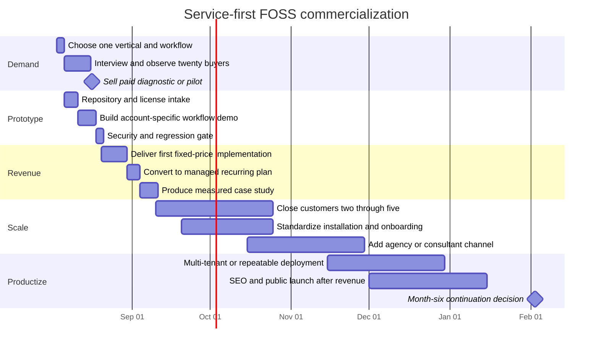

<!--
schema_id: hfo.gen133.deep_research_capsule.v0_1
source_family: OpenAI_ChatGPT_Deep_Research_GPT_5_6_Sol_Pro
prompt_source: olrun_prompt_1_niches_distribution (operator direct)
received_utc: 2026-08-03T~morning
persisted_by: operator_manual_paste_via_dispatch
doc_label: D7
approved_status: unapproved (awaits sigrun_curation V4)
-->

# FOSS-to-Revenue Strategy for a Solo AI-Swarm Developer

## Executive summary

The highest-probability path is **not a cosmetic reskin sold as a new SaaS**. It is a **service-first, vertically packaged implementation of an existing FOSS product**, sold before substantial modification. The initial transaction should be a fixed-price setup, integration, migration, or automation project worth roughly **$750–$3,000**, followed by managed hosting, support, workflow maintenance, or AI usage priced at **$99–$750 per month**. This structure exploits the developer’s unusually strong implementation capacity while avoiding the two largest constraints: no audience and eighteen months without external revenue.

The recommended order is:

1. **Productized AI integration and workflow contracts**, using Activepieces, Papermark, Documenso, Twenty, or a small Open SaaS application as the delivery substrate.
2. **Vertical managed open-source software**, initially sold as an implementation rather than as anonymous self-serve SaaS.
3. **AI-assisted performance-content or SEO operations**, but only where payment is tied to a concrete business workflow—lead qualification, proposal generation, customer support, or content refresh—not commodity article production.
4. **Selective AI-engineering employment applications**, pursued in parallel at low daily time cost because compensation is high, but the probability of receiving money inside thirty days is low.

AI-specific freelance demand remains strong: Upwork reported year-over-year growth of 109% for AI-specific skills, 178% for AI integration, and 329% for AI video generation and editing. At the same time, marketplace evidence shows that generative AI has reduced contracts and earnings in exposed commodity occupations, making undifferentiated writing and low-end coding poor bets. citeturn7search2turn7search6turn0search14turn0search1

The strongest recent solo or very small-team cases are not “build random AI wrapper, launch on Product Hunt.” They combine existing demand, a narrow buyer, and active distribution:

- **IACrea**, built by Pauline Clavelloux for real-estate virtual staging, reported about **$8,638 per month in July 2024** and later a portfolio exceeding $100,000 ARR, despite her lacking prior real-estate experience or an overlapping audience. citeturn8search8turn8search10
- **Lancer**, Ivan Nedelkovski’s Upwork-scaling agent, reported **$10,000 MRR in sixty days** and approximately $20,000 MRR by July 2026; importantly, it followed agency experience and a structured validation process rather than a blind launch. citeturn8search0turn15search5turn15search24
- **SuperX**, Rob Hallam’s X analytics product, reported $1,000 MRR on its first day and approximately **$23,000 MRR by February 2026**; its distribution insight came from prior agency work and earlier failed products. citeturn8search3
- **Postiz**, an open-source social-media scheduler, was reported at approximately **$2,000 MRR** after switching to an open-source distribution strategy; the account also reported 15,000 GitHub stars and substantial Docker adoption. This is a relevant but founder-reported, not audited, open-source commercialization case. citeturn15search20
- **HabitKit**, Sebastian Röhl’s solo app, reportedly generated more than **$600,000 during 2025**, showing the upside of a polished consumer utility, but this is an outlier rather than an appropriate base-rate expectation. citeturn0search2

The principal recommendation is therefore:

> **Sell a vertical workflow before building a vertical platform.**

A concrete first offer could be:

> “I install a private AI-assisted lead-to-proposal system for HVAC contractors in ten business days: website or email intake, document extraction, CRM synchronization, draft scope and proposal, approval workflow, e-signature, and follow-up dashboard. Fixed setup: $1,500. Managed operation: $249/month.”

That offer can be assembled from Activepieces plus Papermark or Documenso, with custom TypeScript/Python services and LLM routing through LiteLLM. Its value is the workflow and implementation, not ownership of a lightly recolored upstream interface.

The major evidentiary limitation is that platforms generally **do not publish acceptance rates, first-time-seller rejection rates, average revenue per game, average contract value, or median solo-founder SaaS revenue**. Where the requested metric is unavailable, this report marks it as unpublished rather than replacing it with anecdote.

## Bayesian niche ranking

### Method and interpretation

The ranking uses the requested objective:

\[
\text{score} =
P(\text{first \$500 within 30 days})
\times
P(\text{\$5,000 monthly run-rate by month six})
\]

These are **decision estimates**, not observed platform statistics. They incorporate the stated constraints: no audience, prolonged zero income, high technical capacity, substantial daily availability, modest capital, and no verified sales history. “HFO swarm” is interpreted as a high-fan-out orchestrator–worker system capable of parallel research, implementation, testing, migration, content generation, and prospect personalization.

The probabilities should be read as approximate midpoints with at least ±30% relative uncertainty. The source data establishes demand, price ranges, outcome dispersion, and examples; it does not directly provide these probabilities.

| Rank | Niche | First $500 in thirty days | $5,000/month by month six | Product score | Evidence-based interpretation |
|---:|---|---:|---:|---:|---|
| 1 | Productized AI integration and automation contracts | 45% | 32% | **14.4%** | Fastest path to invoicing; AI integration demand is growing rapidly, and marketplace AI engineering rates are commonly quoted at $35–$60/hour, with specialist machine-learning work reaching much higher ranges. citeturn7search2turn0search18turn0search4 |
| 2 | Vertical managed FOSS deployments | 30% | 38% | **11.4%** | A setup fee can produce early cash while recurring hosting, support, workflow operation, and integrations build MRR. Recent vertical AI and open-source cases support the upside, although no reliable cohort median exists. citeturn8search8turn8search0turn15search20 |
| 3 | AI-assisted performance content and SEO operations | 35% | 22% | **7.7%** | Easier to demo and sell than software, but exposed to commoditization. Best when coupled to measurable traffic, conversion, refresh, or distribution operations rather than per-word output. citeturn11search0turn0search14turn9search35 |
| 4 | AI-engineering employment | 9% | 50% | **4.5%** | Low thirty-day probability because of screening and interview cycles; extremely high value if successful. Current frontier-lab roles advertise base salaries around $300,000–$485,000 for several senior functions. citeturn10search0turn10search6turn10search12 |
| 5 | Pure vertical B2B micro-SaaS | 15% | 28% | **4.2%** | Potentially durable but usually slower without an existing channel. SaaS outcome data is highly polarized: top performers grow quickly while median businesses do not. citeturn7search0turn7search4turn7search9 |
| 6 | AI-assisted freelance ghostwriting or video editing | 25% | 12% | **3.0%** | A plausible first transaction, weak scaling unless converted into an agency, productized system, or premium executive niche. AI video demand is growing; generic writing is under pressure. citeturn7search2turn0search14turn9search7 |
| 7 | AI infrastructure, evals, observability, MCP, or agent tooling | 12% | 22% | **2.6%** | Technically aligned, but crowded and difficult to distribute. Enterprise need for domain-specific evals and continuous measurement is real; solo revenue evidence is weak. citeturn9search13turn9search9 |
| 8 | AI education and implementation courses | 15% | 15% | **2.3%** | Technically easy to produce, but no audience makes acquisition expensive. Consulting-led workshops are more plausible than a prerecorded course library. |
| 9 | Game portal remixes | 10% | 10% | **1.0%** | Fast to build, hard to differentiate, and highly dependent on retention, publisher acceptance, and featuring. Platform revenue distributions are not public. citeturn2search0turn2search1turn7search30 |
| 10 | Non-game asset packs | 15% | 5% | **0.8%** | Low production cost and possible first sales, but discovery and defensibility are weak without a following or distinctive style. No credible audited 2024–2026 cohort revenue dataset was found. |
| 11 | SEO farms and generalized generated-content sites | 8% | 6% | **0.5%** | Search volatility, weak differentiation, long feedback loops, and severe quality risk. Successful SEO products usually have genuine software utility or established domain expertise, not generated pages alone. citeturn8search18turn16academia13 |
| 12 | Grants, fellowships, SBIR, and prize competitions | 3% | 12% | **0.4%** | Application and evaluation cycles conflict with the thirty-day objective. Grants should be treated as optional upside, not an income plan. |

### Revenue base rates and upside

Exact “base-rate versus top-quartile revenue” figures do not exist for most of these niches. The defensible proxies are as follows.

| Niche | Available base-rate evidence | Upside evidence | What remains unverifiable |
|---|---|---|---|
| Freelance AI integration | Upwork quotes AI engineers at roughly $35–$60/hour, while broader machine-learning work may range from $50–$200/hour. Upwork charges freelancers 0–15% per contract. citeturn0search18turn0search4turn12search0 | A developer billing twenty hours weekly at $60/hour grosses about $4,800 monthly; higher specialist rates can exceed $8,000. This is arithmetic, not a platform income claim. | Median successful-bid rate, median contract value, median freelancer income, and top-quartile AI-freelancer income are unpublished. |
| B2B SaaS | Lighter Capital reported 28% median annual revenue growth and 65% top-quartile growth in its 2025 B2B SaaS benchmark. ChartMogul’s analysis covers more than 2,500 SaaS companies but does not provide a clean solo-founder revenue median. citeturn7search24turn7search20 | IACrea reached about $8,638/month; Lancer reported $10,000 MRR in sixty days; SuperX reported $23,000 MRR within its first year. citeturn8search8turn8search0turn8search3 | Revenue quartiles specifically for solo, AI-assisted, bootstrapped micro-SaaS are unavailable. |
| Subscription apps | RevenueCat reported median MRR growth of 5.3% and top-decile growth above 306%, illustrating extreme dispersion rather than typical fast success. citeturn7search0turn7search4 | HabitKit’s reported $600,000-plus 2025 revenue is a high-end solo result. citeturn0search2 | Median dollar MRR for a new solo app cohort is not disclosed in the cited benchmark. |
| Content and SEO services | Upwork’s Huntr case reported growth from zero to 140,000 blog visits, threefold Google impressions, and double-digit monthly content growth through an AI-capable freelancer, but did not disclose freelancer earnings. citeturn11search0 | Nicolas Cole reports building a ghostwriting offer from zero to $20,000/month in under sixty days and later a multimillion-dollar agency. This is a founder account, not a representative outcome. citeturn9search7 | Current median solo AI-content-service income and top-quartile revenue are not reliably published. |
| Games | GDC reported that half of developers self-funded and that 80% were focused on PC; one-third used generative AI. These figures describe production conditions, not income. citeturn7search30 | Individual hits can be large, but none of the requested browser portals publishes a credible average payout per accepted game. | Acceptance rates, median accepted-game revenue, first-time developer rejection rates, and average time to featuring are unpublished. |
| Employment | Several current Anthropic roles advertise base salaries of approximately $300,000–$485,000, depending on role and seniority. citeturn10search0turn10search6turn10search12 | Some specialized roles advertise still wider compensation ranges. citeturn10search21 | Applicant-to-offer rates for Anthropic, OpenAI, Cursor, and Cognition are not public. |

### Swarm-specific advantages and disadvantages

The swarm is most valuable where work decomposes into **independent, verifiable artifacts**: repository mapping, customer research, API connectors, document templates, test generation, migration scripts, prospect lists, and personalized demos. It is substantially less valuable when success depends on taste, buyer trust, long-term relationship development, entertainment quality, or a proprietary audience.

| Niche | HFO-swarm advantage | HFO-swarm disadvantage |
|---|---|---|
| AI integration contracts | Parallel repository analysis, integration prototypes, test generation, migration scripts, and account-specific demos can compress delivery from weeks to days. | Agents can overproduce speculative code before requirements are understood; reliability and scope control remain human responsibilities. |
| Vertical managed FOSS | Workers can map a large upstream codebase, isolate branding and domain modules, produce connectors, generate fixtures, and run regression matrices. | The larger the fork, the more upstream merges, security updates, and license obligations consume the solo operator. |
| Performance content | Parallel SERP analysis, content refresh, source extraction, internal linking, brief generation, and QA are naturally parallel. | Commodity output is easy for competitors to replicate; hallucinations, copyright risk, and platform penalties scale with generation volume. |
| Employment search | Agents can map roles, tailor evidence portfolios, identify employees, and rehearse interviews. A 2026 experimental study found that visible AI skills increased modeled recruiter invitation probabilities by roughly 8–15 percentage points across several occupations. citeturn13academia23 | Mass-generated applications are easy to detect and perform poorly; the key bottleneck is credible experience, referrals, and interviews, not application generation. |
| AI infrastructure | The stack is unusually well suited to building eval datasets, traces, provider routers, and automated regression suites. | The segment already includes Braintrust, Langfuse, Helicone, Galileo, Maxim, Fiddler, Evidently, and other established products. citeturn9search9 |
| Games | Agents can produce levels, variants, localization, test bots, balancing simulations, and asset pipelines. | A swarm does not automatically create a novel mechanic, satisfying feel, or retention. High output can create a portfolio of interchangeable clones. |
| Education | Agents accelerate curriculum, examples, exercises, captions, and updates. | Courses are audience businesses. Producing twenty courses does not solve discovery or trust. |

## Channel economics and distribution

### Productized AI integration and automation contracts

The optimal channel order is **warm or narrowly targeted direct outbound**, then **Upwork**, then **Contra and Braintrust**, with **Toptal and Gun.io as optional high-selectivity channels**. Direct outbound offers higher control and no marketplace deduction; Upwork offers active buyer intent but requires bidding and reputation.

| Channel | Current entry and economics | Public conversion or acceptance data | Suitable use | Verified or named case |
|---|---|---|---|---|
| **Direct LinkedIn and email** | No platform gate. Target operations owners, agency principals, local service businesses, and software companies with an observable broken workflow. | Recent application data covering nearly 600,000 job applications put LinkedIn job-application response near 3.1%; this does not measure personalized hiring-manager or buyer outreach. Older LinkedIn evidence reports that referred candidates were hired roughly ten days faster than job-board candidates. citeturn13search5turn13search15turn13search0 | Best for selling a $750–$3,000 implementation against a visible problem. Use a working account-specific demo, not a generic pitch. | Lancer grew from a problem encountered in the Upwork ecosystem and prior agency work rather than a generic launch. citeturn8search0turn15search24 |
| **Upwork** | No elite-network acceptance gate. Connects cost $0.15 each; freelancer fees are 0–15% per contract. Direct Contracts charge the freelancer 5%, or 0% under qualifying Freelancer Plus terms. citeturn12search4turn12search0turn12search22 | Bid-to-hire conversion and average AI contract value are not officially published. | Best marketplace for the first reference project because buyers already state problems and budgets. Bid only when a personalized artifact can be attached. | An official Upwork case describes spending roughly $10–$20 on a tool to help win a $2,000 project. Raza Hussain reported more than $100,000 earned over three years but later eight months of difficulty winning new work, illustrating both upside and platform volatility. citeturn11search1turn0search10 |
| **Contra** | Freelancers pay no commission; client platform fees are capped at $29 per payment. Contra reports 1.25 million creatives and over $150 million earned. citeturn12search1turn12search8 | Acceptance, proposal conversion, average deal size, and first-time rejection rates are not public. | Good as a professional portfolio, invoicing, and contract surface after sourcing buyers elsewhere. | No qualifying 2024–2026 primary-source solo case tying Contra directly to the first $500–$5,000/month was found. |
| **Braintrust** | Current onboarding requires a complete profile and an AI skills interview. Braintrust claims more than two million professionals, over 10,000 active roles, and zero talent fees. citeturn14search2turn14search5turn14search6 | No official acceptance percentage or average contract size is published. A third party has claimed a top-7% screening threshold, but this is not confirmed by Braintrust and should not be treated as authoritative. citeturn14search14 | Secondary channel for enterprise contract and AI-training work. | Braintrust’s displayed testimonials are not sufficiently detailed or independently verifiable to qualify as revenue case studies. |
| **Toptal** | Toptal states that fewer than 3% of applicants are accepted and that screening generally takes three to eight weeks. Published stage pass rates include 26.4% through language/personality review and 7.4% through skill review. citeturn1search0turn1search21 | The acceptance rate is public; average contract value and bid conversion are not. | Worth attempting only with a strong portfolio and senior systems narrative. It is not a thirty-day cash plan. | No qualifying primary-source 2024–2026 solo case linking Toptal entry to first $500–$5,000/month was found. |
| **Gun.io** | Gun.io reports roughly 1,000 applicants and about 100 developers receiving work in a typical month, implying an approximate 10% applicant-to-work ratio rather than a pure admission rate. Average time to hire is reported at thirteen days. Roughly 70% of engaged developers have ten-plus years of experience. citeturn1search8turn1search11turn12search27 | Gun.io publishes the above funnel signals but not proposal conversion or average contract value. US and Canadian rates are reported around $60–$400/hour, with AI and DevOps premiums. citeturn12search9turn12search3 | High-value fallback for senior contract work; less suitable without extensive conventional experience. | No qualifying primary-source solo first-income case was found. |

**Recommended contract funnel:** thirty deeply qualified prospects or jobs per week, not hundreds of generic proposals. For each, have a scout worker identify the workflow, a prototype worker build a narrow proof, a copy worker produce a sixty-second explanation, and a human orchestrator decide whether the prospect merits contact.

The first offer should have fixed scope and an explicit economic result:

- “Convert intake emails and PDFs into structured CRM records and draft proposals.”
- “Install an internal document-search and response assistant with human approval.”
- “Migrate your spreadsheet pipeline into a private CRM with automated follow-up.”
- “Create a secure proposal room with engagement analytics and e-signature.”

Avoid “I build AI agents.” Buyers purchase removed labor, faster turnaround, fewer errors, or additional revenue—not an implementation category.

### Vertical managed FOSS and micro-SaaS

The optimal distribution order is **founder-led niche outbound**, **implementation partners**, **niche communities and associations**, then **SEO and launch communities**. Product Hunt, Hacker News, Indie Hackers, and Reddit should amplify evidence already obtained from buyers; they should not be treated as substitutes for validation.

| Channel | What the evidence supports | Named recent case | Decision |
|---|---|---|---|
| **Founder-led outbound** | A direct offer can generate revenue before a self-serve product exists. One Reddit founder reported Answer HQ’s first annual customer within a week through a friend, then $1,000 MRR and roughly $6,000 total revenue after eight months with seven customers. This is self-reported but directionally realistic for narrow B2B software. citeturn15search6 | Answer HQ, approximately $1,000 MRR after eight months. | Primary channel. Sell five implementations before building generalized onboarding. |
| **Agency and consultant partnerships** | Cuppa reached roughly $58,000–$59,000 MRR as an AI SEO product, but its founder already operated an SEO consultancy reported at $65,000 MRR. The result demonstrates channel leverage, not a cold-start solo base rate. citeturn8search18 | Cuppa. | Strongest scaling channel after one successful vertical installation. Offer a revenue share or wholesale managed instance. |
| **Indie Hackers** | The platform regularly documents high-revenue founder cases, including Lancer at $10,000 MRR in sixty days, Leadmore AI over $30,000 MRR, and an AI design tool at $10,000 MRR in six weeks. These are selected success stories, not outcome distributions. citeturn15search5turn15search15turn15search18 | Lancer, Leadmore AI, and Mattia Pomelli’s design tool. | Useful for narrative, feedback, and backlinks; weak as sole buyer source for non-founder verticals. |
| **Hacker News / Show HN** | In Michael Lynch’s discussion of bootstrapping a side project into a profitable seven-figure business, he stated that the first Show HN made a decisive difference and prevented the product from joining his project graveyard. citeturn15search1 | Michael Lynch’s bootstrapped hardware/software business. | High potential for developer-facing infrastructure or transparent technical products; poor fit for local-business workflow software. |
| **Product Hunt** | Product Hunt can create attention and social proof, but recent research across more than 160,000 launches found that generative AI increased solo-founder entry without increasing solo representation among the highest-quality outcomes; teams remained dominant near the top. citeturn16academia12 | A 2026 founder reported a Product Hunt launch yielding one signup and $0 MRR. citeturn16search6 | Treat as press, not validation. Launch only after paying users exist. |
| **r/SideProject and related communities** | Reddit can provide candid feedback and occasional initial users, but case reports are self-selected. One solo web-development agency reported reaching $4,000 MRR in three months; another product reported $307 revenue and forty-four users in two weeks. citeturn15search17turn15search3 | Answer HQ and Alpha Journal. | Good for transparent build logs and feedback; do not depend on it for repeatable B2B acquisition. |
| **SEO and pull-market content** | A 2026 study of 112 leading Product Hunt products found extremely low discovery in generic LLM recommendations—3.32% in ChatGPT and 8.29% in Perplexity—while backlinks, conventional SEO, ranking, and community presence were more predictive. citeturn16academia13 | BlogMaker reportedly moved from a twenty-hour initial build to five-figure ARR and later more than $5,000/month, though the public descriptions are internally inconsistent and not audited. citeturn8search15 | Build pages around buyer workflows and integrations, not generic “best AI tool” content. Expect months, not days. |

A vertical managed deployment should be positioned as a **system of record plus automation**, not merely as “hosted open source.” The buyer does not care that the starting repository has thousands of stars. The buyer cares that estimates are generated faster, documents are not lost, customer messages are answered, or compliance evidence is available.

### AI-assisted performance content

Commodity article production is a deteriorating niche. Brookings found that generative-AI-exposed freelance occupations experienced approximately 2% fewer contracts and 5% lower earnings after ChatGPT’s arrival, while Upwork’s own research found contraction in writing and translation alongside gains in higher-value analytical categories. citeturn0search14turn0search1

The defensible offers are therefore operational:

| Offer | Deliverable | Pricing shape | Primary channel |
|---|---|---|---|
| Content refresh operation | Identify decaying pages, update sources, add product evidence, improve internal links, and measure recovery | $1,000–$3,000 setup plus $500–$2,000/month | Upwork, SEO agencies, direct outreach to sites with visible content decay |
| Sales-enablement content system | Convert calls, tickets, and proposals into case studies, comparison pages, objection libraries, and sales collateral | $1,500–$5,000 project | Founder LinkedIn, agencies, B2B SaaS firms |
| Programmatic location or service pages | Structured data ingestion, templated copy, human QA, uniqueness checks, conversion tracking | $2,000–$10,000 project | Local SEO agencies and multi-location operators |
| Executive ghostwriting system | Interviews, research, draft, fact-check, distribution, analytics | $1,500–$5,000/month | Direct referrals and LinkedIn |
| Video ideation and repurposing | Research, hooks, scripts, clips, titles, thumbnails, and performance feedback | $1,000–$4,000/month | YouTube agencies, coaches, and B2B founders |

Nicolas Cole’s reported move from zero to $20,000/month in less than sixty days illustrates the upside of premium ghostwriting, but it depended on sales, positioning, and service delivery—not merely Claude-generated prose. citeturn9search7

### Required game-platform comparison

None of the browser-game channels publishes enough data to compute the requested average revenue, rejection rate for first-time solo developers with twenty-plus games, or average time to first featuring. Those fields are therefore **unverifiable**.

| Platform | Submission and monetization facts | Public acceptance/rejection rate | Public average revenue or time to feature | Practical judgment |
|---|---|---|---|---|
| **Poki** | Poki invites developers to reach millions of players and monetize through its developer program. citeturn2search0turn2search4 | Unpublished | Unpublished | High distribution upside, but do not assume a reskin or clone will pass quality review. |
| **CrazyGames** | Games undergo initial QA, a Basic Launch test with real users, and potentially global release after performance review and full SDK/QA integration. Initial downloads should generally be at most 50 MB, with a 250 MB total and file-count limits. Payout threshold is €100; contractual terms are NET60, although the platform says payments are commonly processed earlier. citeturn2search1turn2search5turn2search9turn2search12 | Unpublished | Unpublished | Best platform for instrumented iteration because the Basic Launch stage creates a measurable retention test. |
| **Kongregate** | Its 2026 “Welcome Back” program offers approved qualifying games up to a 70% revenue share, with payments generally within forty-five days after month-end. citeturn2search3turn2search11turn2search20turn2search23 | Unpublished | Unpublished | Worth testing while the 2026 incentive exists; revenue share does not imply meaningful traffic. |
| **itch.io** | Open Revenue Sharing lets creators choose itch.io’s share from 0% to 100%; the conventional default example is 10%, plus payment processing costs. There is no conventional publisher gate, although project-page and account policies apply. citeturn2search2turn2search6turn2search10 | No normal acceptance gate | No useful platform-wide average | Easiest place to publish; weak discovery and no assurance of sales. |
| **Game Jolt** | Reliable current partner-level acceptance and revenue data was not found. | Unpublished | Unpublished | Use as an additional community surface, not a primary financial model. |
| **Observed low-result case** | The developer of *The Hive* reported 68,000 page views, 618 followers, twenty-two sales, and only $227.08 lifetime revenue on Game Jolt. This is a single self-reported case, not a platform average. citeturn3search7 | — | — | Demonstrates that attention and follows can coexist with negligible commercial conversion. |

A game strategy would require original mechanics, retention instrumentation, rapid variant testing, and a portfolio approach. Given the urgent income constraint, it should receive no more than 10% of working time unless an early prototype produces unusually strong retention or a publisher asks for further development.

### Employment through LinkedIn and referrals

Employment should run as a parallel hedge. Current official job pages show frontier labs and AI-product companies hiring for research tooling, agent quality, infrastructure, enterprise platform, and forward-deployed engineering. OpenAI’s forward-deployed roles emphasize customer-facing API solutions, while Cursor lists agent evaluation, quality, infrastructure, growth, developer productivity, and enterprise engineering roles. citeturn10search4turn10search7turn10search2turn10search5turn10search14

LinkedIn Easy Apply should not be the core method. A large 2025 application dataset reported a roughly 3.1% response rate for LinkedIn applications. Referrals and direct sourcing generally outperform inbound applications; newer recruiting benchmarks estimate employee-referral conversion at many times the inbound baseline, although exact estimates vary by dataset and should not be treated as universal. citeturn13search5turn13search11turn13search9

The practical sequence is:

1. Select twenty roles where the existing stack maps directly to the listed work.
2. Build a small role-specific public artifact: an eval harness, MCP integration, LiteLLM routing benchmark, DBOS durable-agent demo, or Cloudflare deployment.
3. Contact engineers or hiring managers with the artifact and one precise technical question.
4. Request a referral only after establishing relevance.
5. Apply within hours of a new posting, not weeks later.

A 2026 paper on referral-request agents found that retrieval-augmented rewriting improved predicted success for weaker requests by about 14% without degrading stronger requests; the result is model-predicted rather than a real-world referral experiment, but it supports using a swarm to improve weak outreach rather than blindly generating more messages. citeturn13academia19

## FOSS seed shortlist

### Selection rules

A repository ranks highly only when it:

- Fits TypeScript, Python, Postgres, or the existing deployment workflow.
- Solves a business process for which setup and managed service can be sold.
- Can be verticalized without reproducing an entire incumbent’s product surface.
- Has a license that permits the intended operation, subject to obligations.
- Can produce a credible paid pilot in fewer than roughly three hundred focused hours.
- Has a monetization surface beyond cosmetic branding.

The probability estimates below mean the chance of reaching a **$5,000 monthly combined run-rate from setup fees plus recurring revenue by month six**, assuming disciplined outbound and at least fifty relevant buyer conversations. They are analytical estimates, not repository statistics.

### Ranked candidates

| Rank | Seed and repository | License and compliance | Product to build | Stack fit and estimated MVP effort | Monetization and distribution | Estimated month-six probability |
|---:|---|---|---|---|---|---:|
| 1 | **Activepieces** — `github.com/activepieces/activepieces` citeturn17search1 | Community Edition is MIT; enterprise directories use a separate commercial license and must be excluded unless licensed. citeturn17search1turn17search21 | Vertical automation appliance for HVAC, real estate, recruiting, agencies, or professional services: intake → extraction → CRM → proposal → signature → follow-up. | TypeScript core, TypeScript connector SDK, hundreds of integrations. Approximately **80–160 hours** for one vertical with five hardened workflows. citeturn17search9turn17search33 | $1,500–$5,000 setup; $249–$750/month managed workflows; custom connectors. Sell through direct workflow audits, Upwork, and agency partners. | **38%** |
| 2 | **Papermark** — `github.com/papermark/papermark` citeturn17search3 | Core is AGPLv3; enterprise code is separately licensed. Modified network deployments require source-availability compliance. citeturn17search15turn17search31 | Secure proposal rooms, buyer portals, investor rooms, HVAC bid rooms, legal document portals, or agency client rooms with AI summaries and engagement alerts. | Next.js, TypeScript, Tailwind, Prisma, Postgres, NextAuth, Resend and document analytics. Approximately **60–120 hours** for a narrow proposal-room pilot. citeturn17search3turn17search35 | $750–$2,500 setup; $99–$399/month; branded templates, storage, analytics, AI document Q&A. Direct outreach to agencies, brokers, contractors, and consultants. | **35%** |
| 3 | **Documenso** — `github.com/documenso/documenso` citeturn18search0turn18search21 | Community Edition is AGPL-3.0; commercial licensing removes AGPL disclosure requirements for proprietary integration. SDKs and embeds have separate permissive licenses. citeturn18search12turn18search21 | Vertical agreement and approval workflow: contractor change orders, agency approvals, property forms, onboarding packets, or compliance attestations. | Strong TypeScript and PostgreSQL alignment; official TypeScript and Python SDKs. Approximately **100–180 hours** including templates, audit trails, reminder flows, and a vertical dashboard. citeturn18search8turn18search21 | $1,000–$4,000 setup; per-document or $149–$499/month managed plan. Partner with consultants already producing repetitive documents. | **32%** |
| 4 | **Open SaaS by Wasp** — `github.com/wasp-lang/open-saas` citeturn17search0turn17search12 | MIT. Preserve copyright and license notices. It is a starter rather than an incumbent application, reducing fork and trademark risk. citeturn17search4turn17search16 | Purpose-built vertical portal, AI operations dashboard, document extractor, RAG assistant, or customer workflow app. | React, Node.js, TypeScript, Prisma, auth, payments, jobs, admin functions, and an AI example. Approximately **40–100 hours** for a focused MVP. citeturn17search12turn17search32turn17search20 | $49–$299/month SaaS, or $1,000-plus implementation followed by recurring service. Best choice when upstream application complexity is unnecessary. | **30%** |
| 5 | **Twenty CRM** — `github.com/twentyhq/twenty` citeturn18search1 | AGPL-3.0. Public network use of a modified version carries source-availability obligations. | Vertical CRM for contractors, boutique recruiters, deal brokers, grant consultants, or agencies, with AI record enrichment and workflow automation. | TypeScript CRM architecture, self-hosting, programmable objects and app-building capabilities. Approximately **160–300 hours** because of codebase size and migration requirements. citeturn18search9turn18search26 | $2,000–$8,000 migration and setup; $199–$999/month managed instance; integration and data-cleaning fees. Sell against spreadsheet and HubSpot pain. | **28%** |
| 6 | **Formbricks** — `github.com/formbricks/formbricks` citeturn18search2 | Core is AGPLv3; enterprise modules are separately licensed and cannot be assumed available for commercial reuse. citeturn18search6turn18search27 | Regulated customer-feedback, employee pulse, onboarding research, post-service survey, or churn-reason system with AI classification and action routing. | TypeScript stack and embeddable survey surfaces. Approximately **80–160 hours** for one industry pack. citeturn18search23 | $1,000–$3,000 implementation; $99–$399/month managed feedback operation; reporting and response-workflow retainers. | **22%** |
| 7 | **OpenStatus** — `github.com/openstatusHQ/openstatus` citeturn18search11 | AGPL-3.0. Publish required source for modified network deployments and preserve attribution. | Managed uptime, status, and incident-communication service for agencies and small SaaS companies, augmented with AI incident summaries and client reports. | TypeScript-heavy, monitoring-as-code, CLI, GitHub Actions, Terraform, status pages, and multi-region checks. Approximately **60–120 hours** for an agency package. citeturn18search11 | $300–$1,500 setup; $49–$249/month per client; wholesale agency plan. Distribution through web-development and MSP partners. | **20%** |
| 8 | **Chatwoot** — `github.com/chatwoot/chatwoot` citeturn5search3 | MIT, making proprietary vertical extensions more straightforward, subject to preserving license notices. | Vertical customer inbox for property managers, clinics’ nonclinical administration, local services, or multilingual e-commerce, with AI triage and draft responses. | Mature product, but Rails/Vue diverges from the strongest stated stack and increases operations and learning cost. Approximately **180–320 hours** for a production-quality vertical adaptation. citeturn5search3 | $2,000–$8,000 setup; $199–$1,000/month managed support desk; per-seat or per-conversation AI surcharge. | **18%** |

### Why no pure game reskin made the shortlist

A pure FOSS game reskin scores poorly because:

- The asset, music, font, and trademark licenses may differ from the engine or source-code license.
- Clone mechanics offer little defensibility.
- Poki and CrazyGames make publication or expansion decisions based partly on quality and player behavior, not development effort. citeturn2search0turn2search1turn2search5
- None of the relevant portals publishes average accepted-game revenue or a first-time developer rejection rate.
- The only specific recent Game Jolt result found showed substantial views but only $227 lifetime revenue. citeturn3search7

A game should be built only if it starts from a permissively licensed engine or mechanics prototype, replaces all questionable assets, introduces a materially different retention loop, and passes a predeclared retention threshold. It should not displace the service-first plan.

### Candidates excluded or downgraded

**Typebot** uses the Functional Source License for current versions, which restricts offering a competing commercial product until the license converts after the specified period. It is not a safe default for a white-label competing service. citeturn6search2

**Maybe Finance** was archived in July 2025, uses AGPL, has a Rails stack mismatch, and reserves the “Maybe” trademark. It is technically usable under its license but strategically poor for an urgent commercial project. citeturn4search0

**Cal.diy** is MIT-licensed, but its own repository describes it as community-maintained, removes commercial features, recommends caution for production use, and places security and operations responsibility on the self-hoster. It is useful as reference code, not the first commercial seed under the current constraints. citeturn17search2turn17search10turn17search30

### License reality

“Open source” does not mean “unrestricted private reskin.”

AGPL permits commercial use, but a modified program operated for users over a network generally requires those users to be offered the corresponding source of the running version. Papermark’s license text explicitly explains this network-source requirement, and Documenso offers a commercial license for organizations that need to remove it. citeturn17search15turn18search12

The safe monetization layers are therefore:

- Managed hosting and operations.
- Installation and migration.
- Industry configuration and templates.
- Support and service-level commitments.
- Custom integrations.
- Data cleaning and ingestion.
- Training and implementation.
- Usage-based third-party AI.
- Separate proprietary services only after legal review of whether they form a derivative or combined work.

Do not assume that placing proprietary logic behind an API automatically avoids copyleft obligations. Do not reuse upstream names, logos, screenshots, or paid-enterprise modules unless their licenses and trademark policies explicitly allow it. A $400–$800 fixed-fee open-source licensing review is a rational use of the budget before accepting material customer revenue. This report is not legal advice.

## Failure modes and base rates

### What recent failures show

| Attempt | External result | Failure mechanism | Evidence quality |
|---|---|---|---|
| **DemoPolish** | Founder reported seventy-four days, 300-plus founder cold contacts, SEO pages, comparison pages, and email automation with **zero paying customers**. citeturn19search1 | The offer did not create sufficient buyer urgency; more marketing activity did not repair it. | Self-reported Reddit post. |
| **Productivity SaaS built in thirty days** | A 2026 Indie Hackers post reported $0 revenue despite significant AI-assisted shipping volume. citeturn19search25 | Development velocity exceeded demand discovery. | Founder post; exact funnel details limited in search result. |
| **Twenty-five Gumroad products plus outreach** | One founder reported 367 cold emails, thirty-two Indie Hackers posts, twenty-five Gumroad products, and one browser extension after two weeks, producing **$0**. citeturn0search15 | Excessive surface area, weak offer depth, and no compounding channel. | Self-reported. |
| **Monk Mode habit app** | Four months of development reportedly produced zero users and zero revenue. citeturn19search16 | Overengineering a generic consumer category without proven distribution. | Self-reported retrospective. |
| **First two AITuber founder projects** | Founder reported that the first product did not solve sufficient pain and the second had no traction; the third eventually reached $1,000 revenue. citeturn19search8 | Weak pain selection and distribution; repeated iteration eventually found a signal. | Founder LinkedIn post. |
| **Product Hunt launch** | One signup and $0 MRR after launch. citeturn16search6 | Launch attention was mistaken for customer acquisition. | Founder post. |
| **The Hive on Game Jolt** | 68,000 page views and 618 followers but only twenty-two sales and $227.08 lifetime revenue. citeturn3search7 | Weak conversion and low value per audience member. | Developer-reported. |
| **Basedash’s initial direction** | The solo founder described four years in which revenue remained largely flat and growth stopped whenever intense sales effort stopped, despite YC participation and continued development. citeturn16search0 | A weak market or product direction can make good execution feel like pushing a boulder. | Founder’s Product Hunt account. |
| **Upwork drought after prior success** | Raza Hussain reported more than $100,000 earned and a 100% job-success score, followed by eight months struggling to win work. citeturn0search10 | Marketplace demand and ranking are not durable owned distribution. | Freelancer post. |

### Base-rate evidence

Reliable failure-rate evidence is poor because dead projects stop reporting, private revenue is invisible, and “failed,” “dead,” and “zero revenue” are different outcomes.

The strongest recent founder-portfolio evidence found was Alex Belogubov’s report that only **eight of twenty-six projects generated revenue**, implying eighteen non-revenue projects, or about 69%. His first year generated no income, while one later project produced most of the portfolio’s $115,000 revenue. This is one unusually prolific founder, not a population estimate. citeturn19search2

A secondary 2026 article claimed that 54% of Stripe-verified Indie Hackers products made exactly zero revenue, but the underlying dataset and reproducible methodology were not available in the retrieved source. Treat the figure as **unverified**. citeturn19search9

A Reddit analysis claimed that 487 of 500 sampled 2024 Product Hunt SaaS launches were “dead.” Its definition included abandoned products and products under $1,000 MRR—not strictly zero-revenue businesses—and its scraping, matching, and founder-response data were not independently audited. The implied 97.4% should not be presented as an authoritative zero-revenue rate. citeturn16search1

A more credible 2026 academic analysis of more than 160,000 Product Hunt launches found that generative AI sharply increased solo-founder entry, but much of the increase was low-commitment experimentation and teams remained increasingly dominant among top outcomes. It supports a high-failure interpretation but does not report revenue failure rates. citeturn16academia12

### Niches likely above an eighty-percent no-revenue rate

No credible official source was found establishing that any requested niche has an observed **greater-than-80% exact zero-revenue rate**. The following are therefore analytical estimates for a no-audience solo developer, not measured platform statistics.

| Niche | Estimated probability of zero revenue after six months | Basis |
|---|---:|---|
| Generic SEO content farm | **85–95%** | Long search feedback cycle, weak differentiation, and evidence that conventional backlinks and community authority matter more than direct “AI discovery” optimization. citeturn16academia13 |
| Unvalidated AI course library | **85–95%** | Production is easy but audience, authority, and customer acquisition are absent. No qualifying audited recent solo case was found. |
| FOSS game reskin portfolio without publisher relationship | **80–90%** | Unpublished publisher acceptance economics, dependence on retention and featuring, and a concrete low-conversion case. citeturn2search1turn3search7 |
| Generic prompt, image, or music asset packs | **80–90%** | Minimal barriers to entry and no owned audience; credible category-wide revenue data was unavailable. |
| Standalone MCP server or agent-skill marketplace entry | **80–90%** | Strong technical supply, unclear willingness to pay, and crowded infrastructure market. citeturn9search9turn9search13 |
| Blind Product Hunt micro-SaaS launch | **80–90% chance of failing to reach $1,000 MRR**, not necessarily zero revenue | Product Hunt solo entry has increased without equivalent growth in top-tier outcomes; recent individual zero-result and weak-survival reports reinforce the risk. citeturn16academia12turn16search6turn16search1 |
| Grant-only strategy | **Above 90% chance of no cash within thirty days** | Grant decision cycles generally do not fit a thirty-day income objective; no qualifying rapid solo award case was found. |

### Recurrent adversarial failure patterns

**Fork-first behavior.** The developer spends weeks understanding and modifying a large repository before speaking to a buyer. The proper order is buyer workflow, paid pilot, smallest viable upstream component, then customization.

**Cosmetic differentiation.** Color, logo, generated landing pages, and AI chat do not create a new reason to buy. Vertical differentiation requires data model changes, templates, integrations, compliance, migration, and operational responsibility.

**Agent-output inflation.** A swarm creates many features, pages, repositories, or proposals and gives an illusion of progress. The critical metric is paid commitments, qualified calls, workflow completions, or retained users.

**No human approval boundary.** Legal documents, healthcare administration, proposals, and customer communication require explicit review gates. An AI-generated output should normally be a draft with provenance, confidence, and an approval action.

**Local-only production assumptions.** WSL2 is suitable for development, but customer-facing reliability, backups, TLS, email reputation, and uptime require a remote production environment. Cloudflare Workers cannot directly host every Dockerized Rails, Next.js server, or multi-service repository.

**Upstream-fork debt.** Large forks accumulate security fixes and merge conflicts. Prefer extension points, plugins, SDKs, separate workflow services, configuration, and overlays before modifying core code.

**Marketplace dependence.** Upwork can produce cash but cannot be treated as owned distribution; the reported eight-month drought of a previously successful freelancer demonstrates that ratings do not guarantee future work. citeturn0search10

## Build, compliance, and swarm pipeline

### Recommended architecture

Use a split architecture:

```text
Cloudflare Pages
    Marketing site, docs, lightweight dashboard, public assets

Cloudflare Workers
    Webhooks, auth edge, signed URLs, rate limits, lightweight API routes,
    queue ingestion, customer-specific routing

Remote container host
    FOSS application, background workers, document processing,
    Playwright jobs, long-running Python/TypeScript services

Postgres 16 + pgvector
    Customer configuration, document metadata, embeddings,
    workflow state, audit records

DBOS
    Durable workflow steps, retries, approval checkpoints,
    idempotent external actions

LiteLLM
    Anthropic/OpenAI/Gemini/Ollama routing, budgets, fallbacks,
    provider-specific policies

Object storage
    Cloudflare R2 or compatible storage for documents and generated artifacts

Langfuse + OpenTelemetry
    Prompt versions, traces, evaluation data, costs, error analysis

PostHog + Sentry
    Funnel, retention, flags, experiments, frontend/backend failures
```

Cloudflare’s Workers Paid plan starts at $5 per month and includes Workers, Pages Functions, KV, Hyperdrive, and Durable Objects allowances; Cloudflare also states that Workers bandwidth is not separately billed. citeturn20search0turn20search30

PostHog currently includes the first one million product-analytics events and one million feature-flag requests per month at no charge, making it sufficient for early funnels and A/B tests. citeturn20search2turn20search20turn20search28

Langfuse’s core self-hosted platform is MIT-licensed and free, including tracing, evaluations, prompt management, datasets, and LiteLLM-compatible logging; enterprise security features remain separately licensed. citeturn21search1turn21search10turn21search25

Sentry offers a continuing free Developer plan after its initial trial and can cover early error monitoring without immediate expenditure. citeturn21search2turn21search5turn21search14

### Repository intake and compliance pipeline

Every candidate repository should pass an automated gate before a commercial branch is created.

```yaml
repository_intake:
  identity:
    - record canonical repository and commit SHA
    - record upstream owner and trademark policy
    - archive LICENSE, NOTICE, COPYING, and enterprise-license files

  licensing:
    - run licensee or scancode-toolkit
    - generate dependency SBOM with Syft
    - identify AGPL/GPL/SSPL/FSL/custom-license components
    - identify fonts, music, art, models, and sample-data licenses separately
    - generate attribution and source-offer pages

  security:
    - run OSV-Scanner
    - run Trivy or Grype against images and SBOM
    - run Semgrep
    - run Gitleaks
    - block critical vulnerabilities and committed secrets

  quality:
    - install from a clean environment
    - run unit, integration, and Playwright tests
    - capture baseline screenshots and performance metrics
    - document upgrade and rollback procedure

  commercial:
    - verify upstream trademark restrictions
    - remove enterprise-only modules
    - record all local modifications
    - test backup and tenant export
```

GitHub notes that a public repository is not genuinely open source unless it carries a license granting rights to use, modify, and distribute; repository visibility alone is not permission to commercialize it. citeturn17search23

GitHub Actions remains free for standard workflows in public repositories and includes quotas for private repositories, although private overage billing applies. citeturn20search3turn20search7turn20search29

### Packaging and deployment

For TypeScript-native seeds:

- Use `pnpm` with a locked version and frozen lockfiles.
- Build multi-stage Docker images.
- Keep customer configuration in versioned YAML or database migrations rather than source branches.
- Use one deployment manifest per customer only until the tenant model is proven.
- Generate a CycloneDX or SPDX SBOM on each release.
- Sign container images with Cosign.
- Use Renovate for dependency-update pull requests.
- Run Playwright smoke tests after deployment.
- Store database and object-storage backup checksums.
- Keep upstream as a Git remote and rehearse merge or rebase procedures monthly.

For Rails/Vue seeds such as Chatwoot, isolate the upstream application as a service and put custom AI orchestration in TypeScript or Python beside it. Do not teach every worker to modify unfamiliar Rails internals when an API or webhook can accomplish the job.

### Payments

For the first three to five B2B customers, invoices and simple subscriptions are sufficient. Avoid building usage-metering infrastructure before buyers exist.

Two practical routes are:

- **Stripe directly**, when selling primarily to domestic B2B customers and taking responsibility for tax configuration and filings.
- **Lemon Squeezy or Stripe’s managed merchant-of-record arrangement**, when selling a standardized digital product internationally.

Lemon Squeezy currently advertises a base processing price of 5% plus $0.50 per transaction and acts as merchant of record for payment, fraud, sales-tax, VAT, refund, and chargeback responsibilities. citeturn21search0turn21search12turn21search15turn21search18

For high-value implementation contracts, a 5% merchant-of-record fee is usually excessive. Use invoicing or direct card/ACH processing for the setup fee, and consider merchant-of-record processing only for standardized international self-serve subscriptions.

### Analytics and experimentation

Instrument the following events before public release:

```text
lead_created
demo_requested
proposal_sent
proposal_viewed
proposal_signed
workspace_created
data_import_started
data_import_completed
first_workflow_run
first_workflow_success
human_approval_completed
weekly_active_workspace
ai_output_rejected
subscription_started
subscription_cancelled
support_request_created
```

The activation metric must describe a business result, not a UI action. For example:

- Bad: “User opened the dashboard.”
- Good: “A real intake item became an approved proposal.”
- Good: “A real customer conversation was correctly routed and answered.”
- Good: “A real document was shared and viewed by its intended recipient.”

Use PostHog feature flags to compare onboarding, pricing, approval flows, and default templates. Its early feature-flag and analytics allowances are large enough that cost should not be a constraint. citeturn20search20turn20search28

### Swarm operating model

The human remains the only portfolio allocator and customer-commitment authority.

| Worker | Inputs | Required artifact | Cannot decide |
|---|---|---|---|
| Market scout | ICP, location, vertical keywords | Ranked buyer list with observed workflow evidence and source links | Whether a prospect is contacted |
| Interview analyst | Call transcript and notes | Pain map, current process, frequency, cost, authority, objections | Whether the customer’s statement is true |
| License auditor | Repository SHA and intended commercialization | License matrix, excluded directories, obligations, trademark risks | Legal acceptability |
| Code cartographer | Repository and target workflow | Dependency map, extension points, change-risk estimate | Product scope |
| Prototype worker | Approved acceptance test | Minimal working demonstration and test results | Whether to add features |
| Integration worker | API docs and credentials sandbox | Connector, fixtures, idempotency tests, rollback notes | Production credential access |
| Test adversary | Build and requirements | Failure cases, security findings, regression suite | Waiving critical failures |
| GTM worker | Approved product facts and proof | Account-specific message, demo script, case-study draft | Sending bulk outreach |
| Eval worker | Traces, expected outputs, rejection examples | Dataset, rubric, regression scorecard | Changing customer-visible behavior |
| Release worker | Signed release candidate | SBOM, changelog, deployment and rollback report | Production promotion |

Use local Granite or Mistral models for repository summarization, boilerplate tests, log classification, and inexpensive prospect classification. Use Sonnet-class models for routine code implementation and structured content. Reserve Opus-class models for architecture, difficult debugging, license synthesis, security review, and final customer deliverables. Use a second model family as a critic for high-risk outputs.

Each swarm task should contain:

```json
{
  "goal": "One externally testable outcome",
  "inputs": ["Immutable source references"],
  "constraints": ["License", "security", "scope", "cost"],
  "acceptance_tests": ["Executable or inspectable checks"],
  "output_path": "Named artifact location",
  "stop_conditions": ["Ambiguity", "failed tests", "missing permission"],
  "reviewer": "Independent worker or human"
}
```

The swarm should never receive the objective “make this product better.” It should receive objectives such as “import this anonymized HVAC estimate spreadsheet and produce a validated Twenty migration mapping” or “reduce the median time from uploaded scope PDF to human-approved proposal below five minutes on this test set.”

## Budget, timeline, and kill criteria

### Stage-gated budget

Do not spend the full $3,000 before revenue. Release funds only when the preceding stage produces evidence.

| Allocation | Maximum | Trigger | Use |
|---|---:|---|---|
| Production hosting, database, storage, backups | $450 | First live demo or signed pilot | Six months of a small remote container host, backup storage, email, and Cloudflare Workers |
| Model and document-processing API budget | $600 | Paid pilot or repeatable benchmark | Anthropic/OpenAI/Gemini calls, OCR or document parsing where required; local models remain default for low-risk work |
| Prospecting, domains, email, and calls | $500 | ICP and offer approved | Domain, mailbox, data enrichment, calling, and narrowly targeted prospect research |
| Design, licensed assets, demo video, accessibility | $350 | Buyer has accepted workflow concept | Professional template assets, icons, voice or video production, accessibility testing |
| Open-source license and contract review | $600 | Before first material deployment of AGPL or mixed-license code | Attorney review, customer terms, privacy and data-processing terms |
| Security or specialist review | $250 | Before handling customer-sensitive documents | External review of auth, tenant isolation, backup, and secrets |
| Contingency | $250 | Human approval only | Unexpected hosting, migration, refunds, or upstream change |
| **Total** | **$3,000** | — | — |

Cloudflare can remain near $5 per month initially, PostHog and Sentry have useful free tiers, public GitHub Actions workflows are free, and self-hosted Langfuse core has no software license fee. The budget should therefore be spent primarily on buyer acquisition, compliance, and production reliability rather than additional developer tooling. citeturn20search0turn20search2turn20search7turn21search1turn21search2

### Execution timeline



### Daily allocation

Until the first customer pays:

| Activity | Daily time |
|---|---:|
| Buyer research, interviews, proposals, and follow-up | 4 hours |
| Account-specific demonstrations | 2 hours |
| FOSS evaluation and implementation | 2–3 hours |
| Contract or job-platform applications | 1 hour |
| Measurement, retrospective, and queue planning | 1 hour |
| Optional game, asset, or experimental work | At most 1 hour |

After the first paid pilot, delivery can temporarily consume more time, but outbound must not fall below ninety minutes per working day. Otherwise the business repeatedly returns to zero pipeline after every project.

### Kill and escalation criteria

**Kill an offer after thirty qualified conversations** when fewer than three buyers confirm that the workflow is frequent, painful, and budgeted.

**Kill a prototype after fourteen days** if no prospect agrees to a paid pilot, deposit, letter of intent with a date, or introduction to the economic buyer.

**Do not build multitenancy** until three customers have paid for materially similar implementations.

**Do not fork core upstream code** until configuration, plugins, SDKs, webhooks, and sidecar services have been proven insufficient.

**Stop a portal-game prototype** if its real-user test does not meet a predeclared engagement threshold. Publisher submission, feature work, and asset expansion should follow retention evidence, not precede it.

**Escalate from marketplaces to direct sales** after two successful contracts. Capture testimonials, measured before-and-after results, and referrals so that Upwork or Contra is a lead source rather than the business’s identity.

**Escalate to legal review** before deploying mixed-license or AGPL software for a customer, incorporating enterprise directories, handling regulated information, or promising signatures and documents with legal effect.

**Escalate to a product** only when at least five buyers use the same workflow and at least three pay recurring fees. Before that point, the software remains an implementation asset.

### Final recommendation

The single best initial experiment is:

> **Activepieces-based vertical workflow implementation, combined with Papermark or Documenso only where the buyer requires document rooms or signatures.**

Choose one narrow buyer population—HVAC estimators, real-estate teams, boutique recruiters, small agencies, or another group reachable through public directories. Find a repeated process involving email, PDFs, spreadsheets, customer records, proposals, approvals, and follow-up. Build one buyer-specific demonstration in less than a week. Sell the implementation for at least $750 before generalizing it.

The second-best experiment is a **Papermark-based proposal or deal room** for an industry that currently emails PDFs and cannot observe recipient engagement. It is narrower, faster to demonstrate, and easier to price than an entire CRM.

The third-best experiment is an **Open SaaS-built custom portal** when existing FOSS applications are larger than the buyer’s actual problem. Starting from a permissive SaaS skeleton can be commercially safer and operationally simpler than maintaining a branded fork of a forty-thousand-star platform.

The stack’s exceptional advantage is implementation throughput. Its current weakness is external demand evidence. The operating rule should therefore be:

> **No additional building surface without a corresponding buyer signal.**

The target for August 2026 is not a polished SaaS launch. It is one paid workflow, one measurable outcome, one customer reference, and one repeatable installation path.