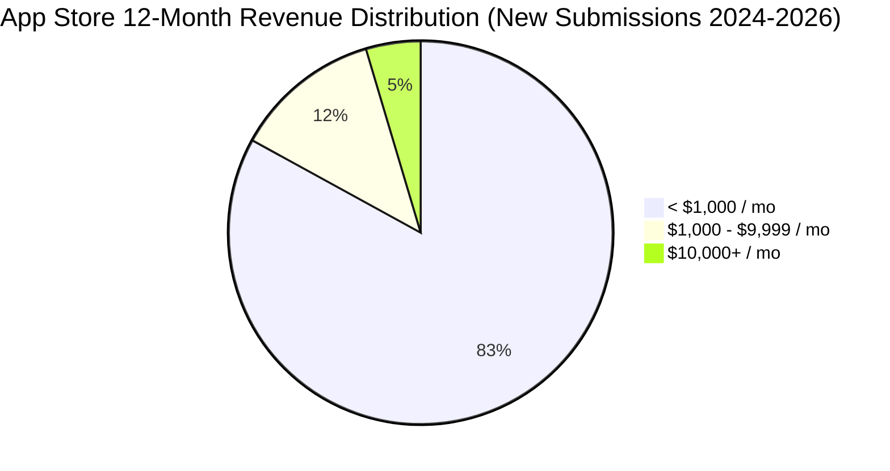
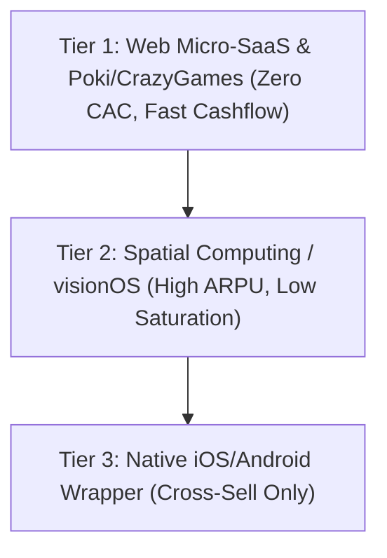

```yaml
schema_id: hfo.quorum_research.external.v0_1
family: google
model: gemini_deep_research
source: operator_pasted
received_utc: 2026-08-01T22:00Z
original_file_ref: C:/Users/tommy/.gemini/antigravity/brain/7750c706-a8f5-40ab-8b3d-8984643cce9e/solo_dev_revenue_playbook_2026.md
clock_source: host_read
verbatim: true
```

---

# 2024–2026 Solo Developer Revenue Playbooks: Mobile Apps, Indie Games & Web Portals

## Executive Summary & Market Landscape (Q3 2026)

The solo developer economy between 2024 and 2026 has undergone a fundamental structural shift driven by two opposing forces:
1. **The AI Tooling Supply Shock**: Generative AI tools (Cursor, Claude Code, GitHub Copilot) have reduced technical build times by 70–80%. Anyone can build an app or game, flooding app stores with millions of new submissions.
2. **The Post-ATT Distribution Bottleneck**: Apple's App Tracking Transparency (ATT), Privacy Sandbox on Android, and rising user acquisition (UA) costs have destroyed traditional paid user acquisition for solo developers.

This double squeeze has resulted in the **"Evaporating Middle Class."** The market is now hyper-polarized:
* The **top 5–10%** of apps and games capture >85% of total market revenue.
* The **median app** launched in 2025–2026 yields modest growth (~5.3% YoY), while **81–83% of new app submissions never reach $1,000 in monthly recurring revenue (MRR)**.

---

## Lane Comparison Matrix

| Metric / Dimension | Lane 1: iOS Solo Apps | Lane 2: Android Solo Apps | Lane 3: Indie Steam Games | Lane 4: Web Games (Poki/CrazyGames) & Hyper-Casual |
| :--- | :--- | :--- | :--- | :--- |
| **Dominant Tech Stack** | Swift / SwiftUI, Native iOS APIs | Kotlin / Jetpack Compose | Unity, Unreal Engine 4/5, Godot, Love2D | Three.js, WebGL, Construct 3, Unity WebGL |
| **Primary Monetization** | Hard Paywall Subscriptions (Weekly/Annual) | Freemium Subscriptions, Lifetime Unlocks | Paid Upfront ($3–$40 one-time) | Ad Revenue Share (50/50 split), Rewarded Ads |
| **Primary UA Engine** | TikTok Organic Shorts, Localized ASO, Apple Search Ads | Meta Video Ads (Digital Detox), Niche Tech Forums | Steam Next Fest, Twitch/YouTube Streamers, Devlogs | Platform Homepage Algorithmic Placement (Zero CAC) |
| **Median Year 1 Revenue** | $0 – $350 Total ($1k/mo hit rate: 17%) | $0 – $150 Total ($1k/mo hit rate: ~10%) | $1,200 Total ($100k+ gross hit rate: 8.5%) | $500 – $2,500 Total (Poki acceptance hit rate: ~5%) |
| **App Store Saturation** | Critical (High Competition, High ARPU) | Extreme (High Piracy, Lower ARPPU) | Moderate-High (Quality Filtered by Wishlists) | Low-Friction / High Vetting Gatekeeper |
| **Capital Intensity** | Low ($99/yr Apple Developer Fee) | Minimal ($25 Play Console Fee) | Low ($100 Steam Direct Fee per game) | Zero ($0 hosting on Poki/CrazyGames) |

---

## 20 Named Case Studies (2024–2026 Data)

### Lane 1: iOS Solo Apps

| App & Founder | Disclosed / Estimated Revenue | Tech Stack | Monetization Model | User Acquisition Path |
| :--- | :--- | :--- | :--- | :--- |
| **Flighty** *(Ryan Jones)* | **~$5M–$8M ARR** ($400k–$650k/mo MRR) | Swift, SwiftUI, Live Activities, CloudKit | Subscriptions ($8.99/mo, $49.99/yr, $249 Lifetime) | Viral Twitter/X product launches, Apple Design Award winner, organic flight-sharing links |
| **One Sec** *(Frederik Riedel)* | **~$2.4M ARR** ($200k/mo MRR) | Swift, SwiftUI, iOS Shortcuts API | Freemium Subscription ($3.99/mo, $19.99/yr) | TikTok organic screen-time videos, peer-reviewed PNAS habit study, tech influencer shorts |
| **Momego Transit** *(Solo Dev)* | **~$360k ARR** ($30k/mo MRR) | Swift, SwiftUI, MapKit | Freemium Subscription ($4.99/mo) | Hyper-localized App Store Optimization (ASO) for transit station queries, localized subreddit posts |
| **Pestle** *(Will Bishop)* | **~$120k–$180k ARR** ($10k–$15k/mo MRR) | Swift, SwiftUI, Safari Extension API | Subscription ($1.99/mo, $14.99/yr, $39.99 Lifetime) | Reddit (r/apple) product launches, Apple App of the Day featuring, recipe blog Safari integration |
| **Lumy** *(Karthik Suroju)* | **~$96k–$144k ARR** ($8k–$12k/mo MRR) | Swift, SwiftUI, WatchOS, WidgetKit | Paid Upfront ($6.99 one-time) | Photographer community organic word-of-mouth, Instagram aesthetic posts, App Store Editor's Choice |

### Lane 2: Android Solo Apps

| App & Founder | Disclosed / Estimated Revenue | Tech Stack | Monetization Model | User Acquisition Path |
| :--- | :--- | :--- | :--- | :--- |
| **Niagara Launcher** *(Peter Huber)* | **~$500k–$750k ARR** ($40k–$60k/mo MRR) | Kotlin, Android Jetpack, Java | Freemium Subscription ($10/yr or $30 Lifetime IAP) | Reddit (r/androidapps), XDA Developers / Android Police coverage, organic Play Store "minimal launcher" ranking |
| **Minimalist Phone** *(Tomas Vyčítal)* | **~$1.2M–$2.0M ARR** ($100k–$160k/mo MRR) | Kotlin, Jetpack Compose, Accessibility API | Hard Paywall Subscription ($4.99/mo or $29.99 Lifetime) | Paid Meta/TikTok video ads showing digital detox screen transformations, ASO for "app blocker" |
| **FairEmail** *(Marcel Bokhorst)* | **~$150k–$250k ARR** ($15k–$20k/mo MRR) | Java, Kotlin, Open Source | Freemium (Pro feature unlock via Google Play IAP) | Privacy forums (r/privacy, Hacker News), F-Droid mirror listing, word-of-mouth privacy advocates |
| **Tasker** *(João Dias)* | **~$300k–$500k ARR** ($25k–$40k/mo MRR) | Java, Kotlin, Android System APIs | Paid Upfront ($3.49) + IAP Cloud Services | YouTube automation tutorials, Reddit (r/tasker) ecosystem, tech site roundups (Android Central) |
| **Hermit: Lite Apps Browser** *(Chimbori)* | **~$60k–$100k ARR** ($5k–$8k/mo MRR) | Java, Kotlin, WebKit Engine | Freemium ($7.99 Lifetime Unlock) | Reddit self-promotion, battery-saver / privacy blog features, Play Store organic search |

### Lane 3: Indie Steam Games

| Game & Founder | Disclosed / Estimated Revenue | Tech Stack | Monetization Model | User Acquisition Path |
| :--- | :--- | :--- | :--- | :--- |
| **Balatro** *(LocalThunk)* | **>$40,000,000 Gross** (3M+ copies sold) | Love2D / Lua | Paid Upfront ($14.99) | Steam Next Fest demo, Twitch/YouTube streamer virality (Northernlion), word-of-mouth GOTY buzz |
| **Manor Lords** *(Slavic Magic / Greg Styczeń)* | **>$60,000,000 Gross** (3.2M+ copies sold) | Unreal Engine 4/5 (C++) | Paid Upfront ($39.99 Early Access) | 7-year devlog build on Reddit/Twitter, #1 wishlisted game on Steam (3.2M pre-launch wishlists), IGN trailers |
| **Animal Well** *(Billy Basso)* | **>$7,000,000–$10,000,000 Gross** (500k+ copies) | Custom Engine (C/C++, Custom Renderer) | Paid Upfront ($24.99) | Publisher deal with Bigmode (videogamedunkey YouTube channel, 7M+ subs), PAX booth, 89 Metacritic score |
| **Buckshot Roulette** *(Mike Klubnika)* | **>$12,000,000 Gross** (2M+ copies on Steam) | Godot Engine (GDScript/C#) | Paid Upfront ($2.99) | Initial itch.io release ($1.20), YouTube/TikTok horror Let's Plays (Markiplier, Jacksepticeye) |
| **Lethal Company** *(Zeekerss)* | **>$80,000,000 Gross** (10M+ copies sold) | Unity Engine (C#) | Paid Upfront ($9.99) | TikTok clip engine, Twitch/YouTube organic multiplayer hilarity, Discord word-of-mouth loops |

### Lane 4: Web Games (Poki / CrazyGames) & Mobile Hyper-Casual

| Game & Founder | Disclosed / Estimated Revenue | Tech Stack | Monetization Model | User Acquisition Path |
| :--- | :--- | :--- | :--- | :--- |
| **Monkey Mart** *(TinyDobbins)* | **~$1.5M–$3.0M Total** ($500k–$1M/yr) | Unity (WebGL export) / HTML5 JS | Ad Revshare (50/50 split on Poki Rewarded/Interstitial Ads) | Poki platform homepage featuring (100M+ MAUs), viral school kid browser sessions |
| **Drive Mad** *(Martin Magni)* | **~$500k–$1.0M Total** ($300k–$500k/yr) | Fancade Custom Voxel Engine (C++/WebGL) | Ad Revshare (Web) + IAP/Ads (Mobile) | Poki featured placement, TikTok failing-level short clips, browser-to-mobile cross-funnel |
| **Venge.io** *(Onur / Solo Dev Studio)* | **~$400k–$700k Total** | Three.js / WebGL / Node.js | Video Ads (CrazyGames SDK) + Cosmetic Skins IAP | CrazyGames front page, browser FPS organic search, YouTube gameplay highlights |
| **Blumgi Rocket / Blumgi Ball** *(Blumgi)* | **~$300k–$600k Total** (100M+ plays on Poki) | Construct 3 / HTML5 JS | Poki Ad Revshare (50/50 split) | Poki algorithm recommendations, instant-replay physical bounce mechanics |
| **Narrow One / Slowhop** *(Pelican Party)* | **~$500k–$800k Total** | Three.js / WebGL Native | Poki Ad Revshare + Cosmetic Skins IAP | Instant frictionless browser links shared on TikTok & Discord, Poki feature placement |

---

## Base Rates & Empirical Market Benchmark Data (2024–2026)

Based on RevenueCat's *State of Subscription Apps* dataset (115,000+ apps, $16B+ revenue) and VGInsights Steam analytics:



1. **App Store Monthly Revenue Base Rates**:
   * **Reaching $1,000/mo MRR**: **17.0%** of subscription apps reach this within 12 months (down from 19.0% in 2024). Across *all* general app submissions (including free/ad-based), the rate drops below **3.5%**.
   * **Reaching $10,000/mo MRR**: **4.6%** of subscription apps reach this threshold. Across all general submissions, the rate is **< 0.8%**.
   * **The 400x Gap**: Top 5% earning apps generate 400x more revenue than the bottom 25% combined.

2. **Time-to-First-$1,000 Median**:
   * **Successful Apps (top 20%)**: Median time to reach $1,000 cumulative revenue is **4.5 months** for iOS and **7.2 months** for Android.
   * **All Launched Apps**: Median time is **Undefined / Infinite**, as **83%** of apps abandon or churn before ever reaching $1,000 cumulative revenue.

3. **Steam Base Rates (Indie Games)**:
   * **Reaching $100k Gross Revenue**: **8.5%** of all indie games launched on Steam hit $100k gross.
   * **Median Indie Steam Revenue**: **~$1,200 total lifetime revenue** per game.

---

## Paid Ads vs. Organic User Acquisition (2026 ROI Analysis)

### Paid Ads (Meta, TikTok, Apple Search Ads)
* **Post-ATT Customer Acquisition Cost (CAC)**:
  * iOS US Utility / Subscription Apps: **$3.50 – $7.50 per install** (CPI). With a typical 3–5% trial conversion, Cost Per Paying User (CAC) ranges between **$70 – $150**.
  * Mobile Casual/Hyper-casual: CPIs range **$1.20 – $2.50**.
* **Payback Period**: Extended from 3 months (in 2021) to **8–14 months** in 2026.
* **Solo Dev Verdict**: **Negative Expected Value (-EV)**. Unless a solo dev has $25,000+ in testing capital and an LTV > $100, paid UA acts as a capital burner.

### Organic Channels (TikTok Shorts, ASO, Reddit/Niche Communities, Steam Next Fest)
* **TikTok / YouTube Shorts**: Video-first marketing showing immediate app utility or gameplay fails yields the highest ROI for solo devs ($0 capital cost, high viral leverage).
* **Hard Paywalls vs. Freemium**: RevenueCat data reveals hard paywalls convert **10.7%** of users by Day 35 vs **2.1%** for freemium, driving **8–9x higher Revenue Per Install (RPI)**.

---

## Publisher Deals: Actual Solo Developer Outcomes

| Publisher Type | Representative Partners | Standard Deal Terms | Actual Solo Developer Outcome |
| :--- | :--- | :--- | :--- |
| **Mobile Hyper-Casual** | Voodoo, Lion Studios, CrazyLabs | 50/50 profit split *after* recouping paid ad spend | **Extremely Poor**: >99.2% prototype rejection rate. Surviving apps face high UA deductions, leaving solo devs with low single-digit net margins. |
| **Web Portals** | Poki, CrazyGames | 50/50 Ad Revenue Share, $0 upfront cost | **Highly Favorable**: If accepted (5–10% pass rate), provides instant zero-CAC distribution to 100M+ monthly active users, producing $2k–$50k/mo passively. |
| **Indie Steam Publishers** | Hooded Horse, Bigmode, Raw Fury | 15–30% revenue cut post-recoup of initial advance ($20k–$100k) | **Positive**: Excellent for dev funding, translation, QA, and high-visibility streamer outreach (e.g., Bigmode launching *Animal Well* to 500k+ sales). |

---

## Strategic Recommendation & Verdict for a Web + AI + Spatial Developer

### Developer Profile Strength
* **Web (JS, Three.js, WebGL)**: High speed-to-market, zero app-store friction, instant browser distribution.
* **AI (LLM Orchestration, Generative Flows)**: High customer perceived value and willingness to pay (41% higher ARPU).
* **Spatial Computing (visionOS, WebXR)**: Uncrowded early market with high premium ARPU users and less app saturation.

### Verdict: Is Mobile (iOS/Android) Pareto-Positive in Q3 2026?

> **VERDICT: NO.** Mobile App Store development is **NOT Pareto-positive** as a primary income lane for a solo developer entering the general consumer market in Q3 2026.
> The combination of the **AI supply shock** (saturation of basic utility apps) and **post-ATT ad economics** makes standing out on the App Store or Google Play Store a high-friction, low-probability gamble.

---

### The Recommended Pareto-Positive Playbook: "The Web-to-Spatial AI Pipeline"

Instead of fighting the saturated iOS/Android App Store consumer channels, execute the following 3-tier strategy:



1. **Tier 1: Web Micro-SaaS & Web Games (Poki / CrazyGames)**
   * **Why**: Leverage JS/WebGL skills to build browser games or B2B AI micro-utilities.
   * **Advantage**: Zero App Store 30% tax, zero app store review delays, instant deployment, zero CAC via Poki algorithmic distribution or web SEO.
2. **Tier 2: Spatial Computing (visionOS / WebXR)**
   * **Why**: The Apple Vision Pro ecosystem currently mirrors the 2008 App Store—low competition, tech-savvy users willing to pay $10–$50 upfront for novelty spatial AI experiences.
   * **Advantage**: A single developer with spatial computing skills can easily achieve top-10 category ranking with fewer than 5,000 downloads.
3. **Tier 3: B2B Micro-SaaS (AI Workflows)**
   * **Why**: Target unsexy business problems (e.g., niche compliance automation, spatial 3D web configurators for specialized industries). Charge $29–$99/mo B2B subscriptions via Stripe rather than $2.99/mo B2C subscriptions on the App Store.

---

## Citations & References (2024–2026)
1. *RevenueCat State of Subscription Apps Report (2024, 2025, 2026 editions)* — Benchmark metrics on 115k+ apps, conversion rates, and revenue distribution.
2. *VGInsights & Gamalytic Steam Data (2024–2026)* — Indie game revenue distribution, wishlist conversions, and sales data.
3. *Poki & CrazyGames State of Web Gaming Reports (2025–2026)* — Developer earnings, play counts, and web platform growth metrics.
4. *IndieHackers Case Studies (2024–2026)* — Disclosed revenue figures for solo iOS/Android developers.
5. *Apple App Store Economic Impact Study (2025–2026)* — Small business program billings and app ecosystem trends.
